# OpenHarmony版Flutter环境搭建指导

## 1. 环境准备

### 1.1 下载并安装OpenHarmony最新DevEco Studio开发工具，及其依赖环境

#### 1.1.1 官方下载地址

[OpenHarmony开发套件官方下载地址](https://developer.huawei.com/consumer/cn/download/)  

注意事项：

1. 目前支持操作系统Linux、Mac、Windows环境下使用。
2. mac系统在终端输入 `uname -m` 判断系统架构选择对应的开发组件套
    如果输出结果是 x86_64，则表示你的系统是x86-64架构
    如果输出结果是 arm64，则表示你的系统是arm64架构。

#### 1.1.2 下载清单

1. 根据自身所用电脑系统下载对应最新版DevEco Studio。

    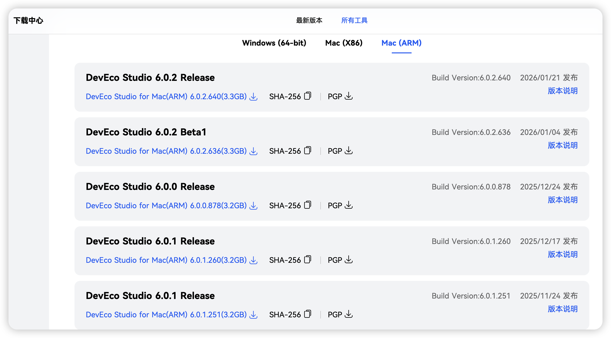


2. 若无OpenHarmony真机，需在DevEco Studio中下载模拟器。
模拟器下载和安装步骤见：[安装模拟器](#### 2.2 安装模拟器)  

3. 下载OpenHarmony版 [flutter](https://gitcode.com/openharmony-tpc/flutter_flutter)。

    通过代码工具下载仓库代码并指定dev或master分支，dev不断在更新相比master拥有更多功能。
    ```
    git clone https://gitcode.com/openharmony-tpc/flutter_flutter.git
    git checkout -b dev origin/dev
    ```

4. 下载FlutterEngine构建产物（非必选项）。

    * 构建Hap命令直接执行 flutter build hap 即可，不再需要 --local-engine 参数，直接从云端获取编译产物。

#### 1.1.3 OpenHarmony开发环境的前置环境依赖

* 由于OpenHarmony系统sdk存在java环境依赖，在[oracle官网](https://www.oracle.com/cn/java/technologies/downloads/#java17)或openjdk官网下载jdk 17环境，并进行相应配置。

* 执行如下命令，检查JDK安装结果，安装成功后进行后续操作。

  ```sh
  java -version
  ```

## 2. 安装说明

### 2.1 解压组件套压缩包后点击DevEco Studio的安装包文件，完成DevEco Studio开发工具的安装。


### 2.2 安装模拟器
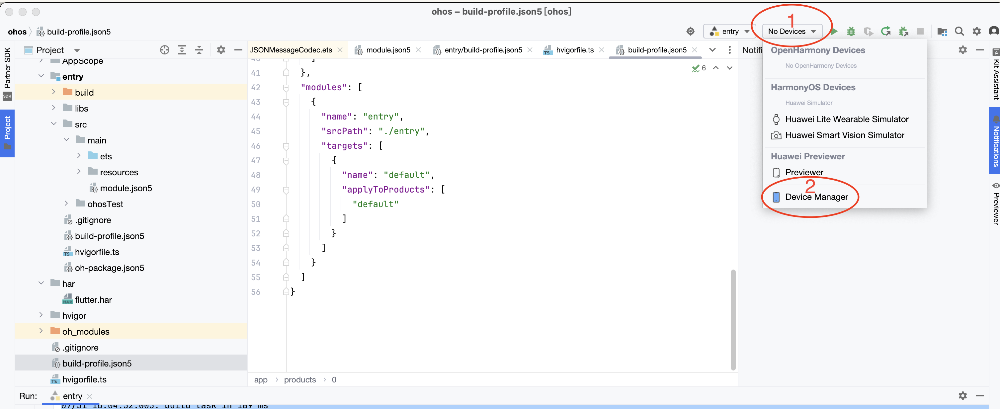
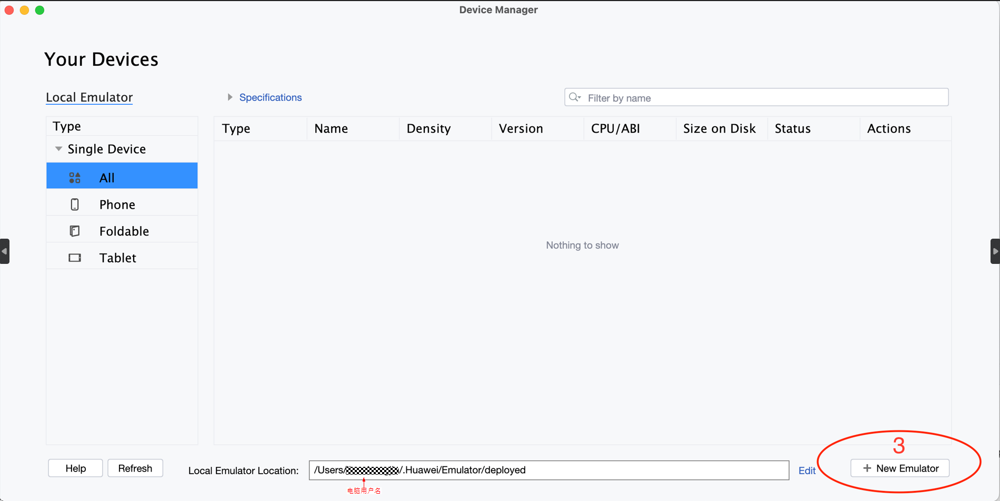
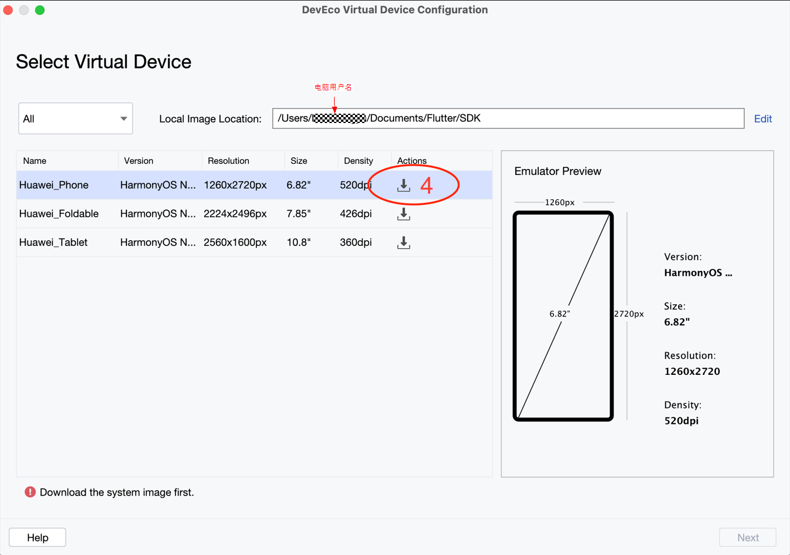
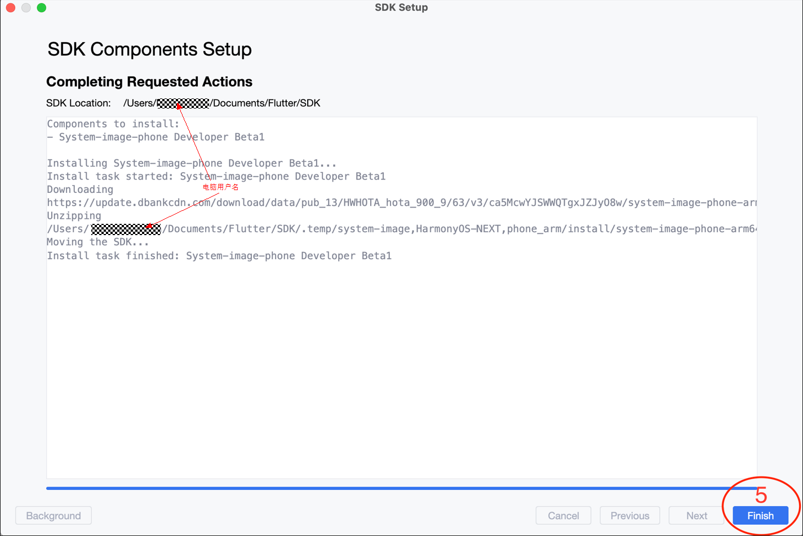
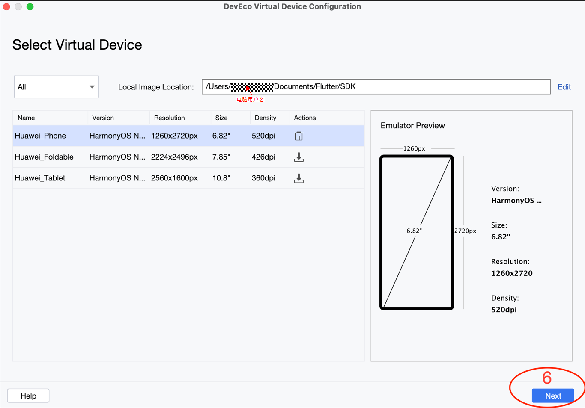
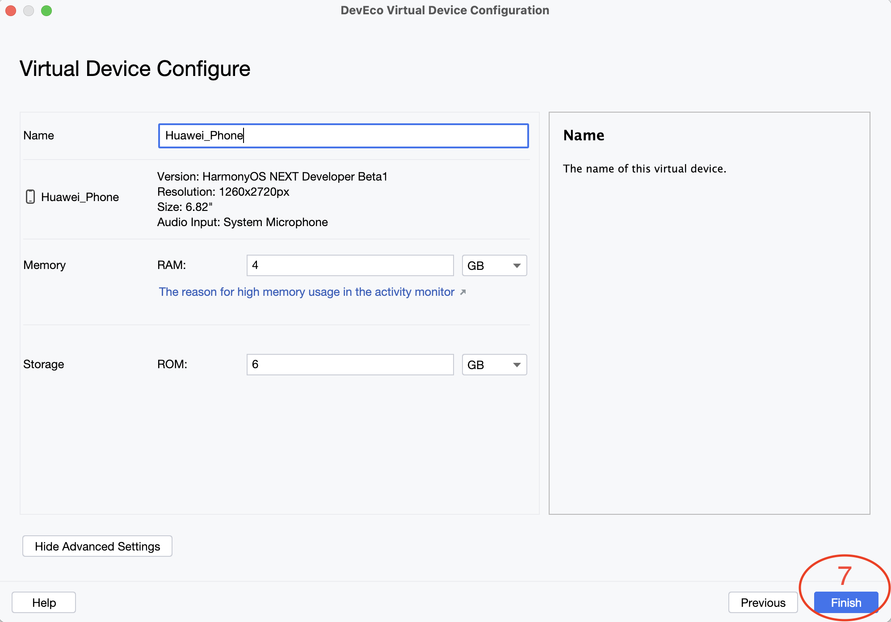

### 2.3 环境变量配置

#### 2.3.1 Mac、Linux：

- ###### 编辑配置文件

  打开终端，执行以下命令编辑配置文件:

  ```bash
  vim ~/.zshrc
  ```

- ###### 在文件中配置环境变量：

  ```bash
  # 配置JDK 17
  export JAVA_HOME=<JAVA_HOME path>/Contents/Home
  export PATH=$JAVA_HOME/bin:$PATH
  
  # 配置OpenHarmony SDK, ohpm, hvigor, node
  export TOOL_HOME=/Applications/DevEco-Studio.app/Contents # mac环境
  export DEVECO_SDK_HOME=$TOOL_HOME/sdk # command-line-tools/sdk
  export PATH=$TOOL_HOME/tools/ohpm/bin:$PATH # command-line-tools/ohpm/bin
  export PATH=$TOOL_HOME/tools/hvigor/bin:$PATH # command-line-tools/hvigor/bin
  export PATH=$TOOL_HOME/tools/node/bin:$PATH # command-line-tools/tool/node/bin
  
  #配置Flutter
  export PUB_CACHE=~/PUB
  export PATH=<flutter_flutter path>/bin:$PATH
  export PUB_HOSTED_URL=https://pub.flutter-io.cn
  export FLUTTER_STORAGE_BASE_URL=https://storage.flutter-io.cn
  ```

- ###### 保存并退出

  按`Esc`键进入命令模式，输入 `:wq`后按 `Enter` 键保存并推出编辑器。

- ###### 应用配置

  执行以下命令重新加载配置使其立即生效：

  ```bash
  source ~/.zshrc
  ```

#### 2.3.2 Windows：

- ###### 打开系统环境变量设置

  通过以下路径访问环境变量配置界面：

  **此电脑**（右键）→ **属性** → **高级系统设置** → **高级** 选项卡 → **环境变量**

- ###### 配置环境变量

  在**环境变量**面板，添加以下配置：

  ① 配置配置 `JDK 17`

  | 变量        | 值                | 作用域       |
  | ----------- | ----------------- | ------------ |
  | `JAVA_HOME` | `<JDK path >`     | 系统变量     |
  | `Path`      | `%JAVA_HOME%\bin` | 追加到现有值 |

  ② 配置 `OpenHarmony SDK` ,`ohpm`, `hvigor`, `node`

  | 变量              | 值                             | 作用域   |
  | ----------------- | ------------------------------ | -------- |
  | `TOOL_HOME`       | `<Deveco-studio Path>`         | 系统变量 |
  | `DEVECO_SDK_HOME` | `%TOOL_HOME%\sdk`              | 系统变量 |
  | `Path`            | `%TOOL_HOME%\tools\ohpm\bin`   | 系统变量 |
  | `Path`            | `%TOOL_HOME%\tools\hvigor\bin` | 系统变量 |
  | `Path`            | `%TOOL_HOME%\tools\node\bin`   | 系统变量 |

  ③ 配置 `Flutter`

  | 变量                       | 值                              | 作用域   |
  | -------------------------- | ------------------------------- | -------- |
  | `PATH`                     | `<flutter_flutter Path>\bin`    | 系统变量 |
  | `PUB_CACHE`                | `<PUB Path>`                    | 系统变量 |
  | `PUB_HOSTED_URL`           | `https://pub.flutter-io.cn`     | 系统变量 |
  | `FLUTTER_STORAGE_BASE_URL` | `https://storage.flutter-io.cn` | 系统变量 |

### 2.4 运行模拟器

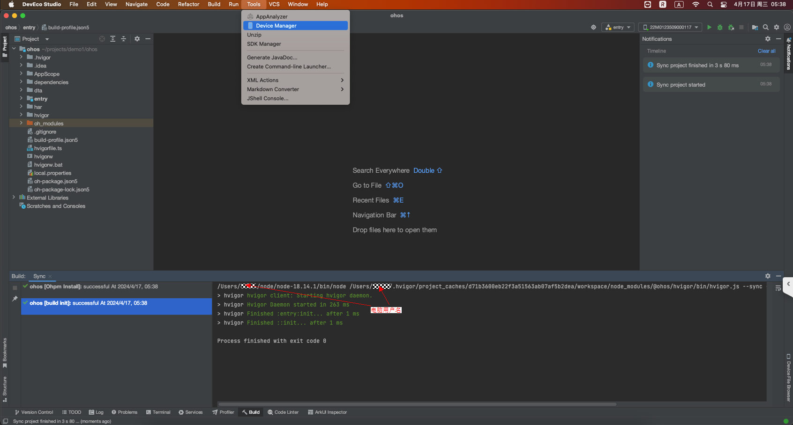

创建模拟器

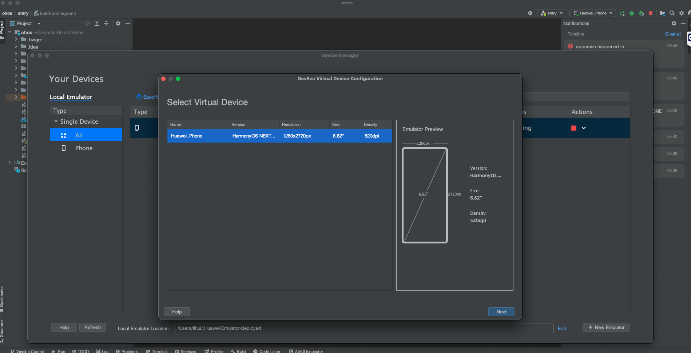

准备启动模拟器

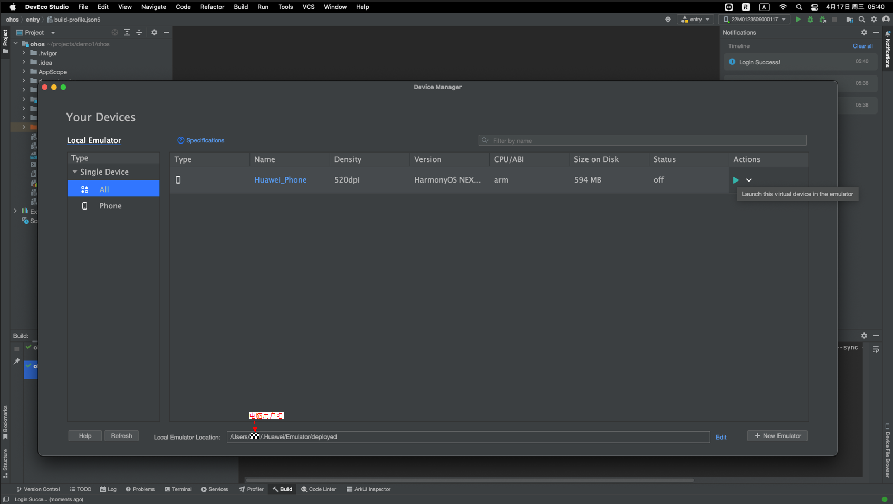

模拟器运行效果


## 3.集成与调试OpenHarmony版Flutter

### 3.1 检查环境

运行`flutter doctor -v`检查环境变量配置是否正确，Futter与OpenHarmony应都为ok标识，若两处提示缺少环境，按提示补上相应环境即可。

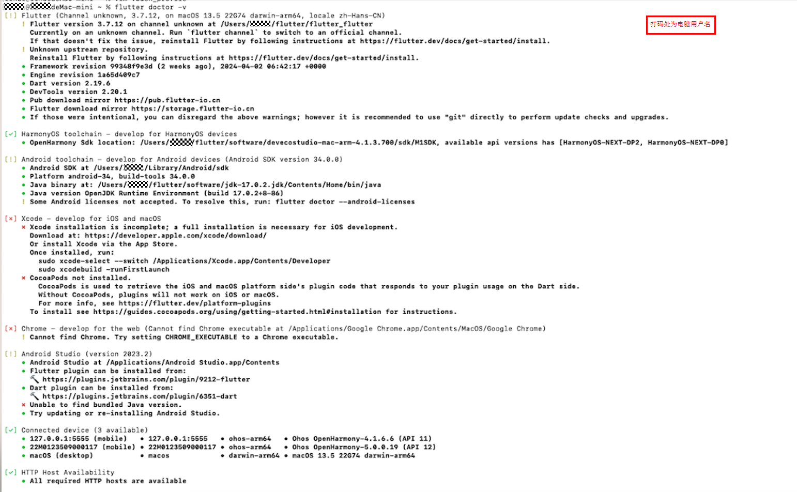


### 3.2 创建Flutter工程

创建工程与编译命令，编译产物在 `${projectName}/ohos/entry/build/default/outputs/default/entry-default-signed.hap` 下。

```sh
# 创建工程 方式一 该方式只创建了ohos平台
flutter create --platforms ohos <projectName> 

# 创建工程 方式二 该方式创建了android,ios,ohos三个平台
flutter create  <projectName> 

# 进入工程根目录编译hap包
flutter build hap --debug
```

### 3.3 OpenHarmony真机运行Flutter项目

#### 3.3.1 项目签名

在运行到真机之前，需要对项目进行签名，具体操作如下：
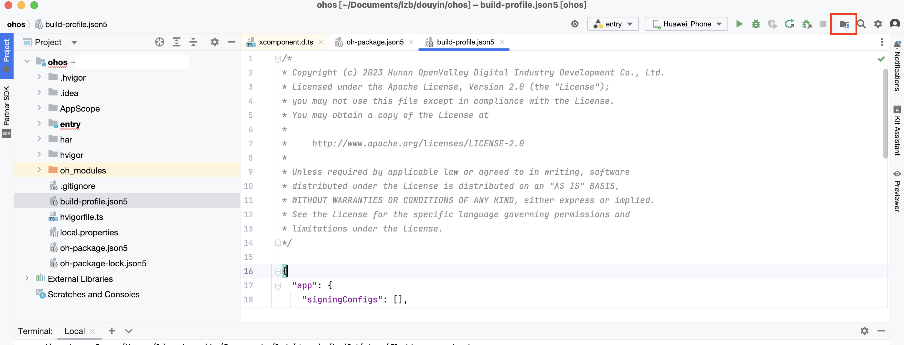
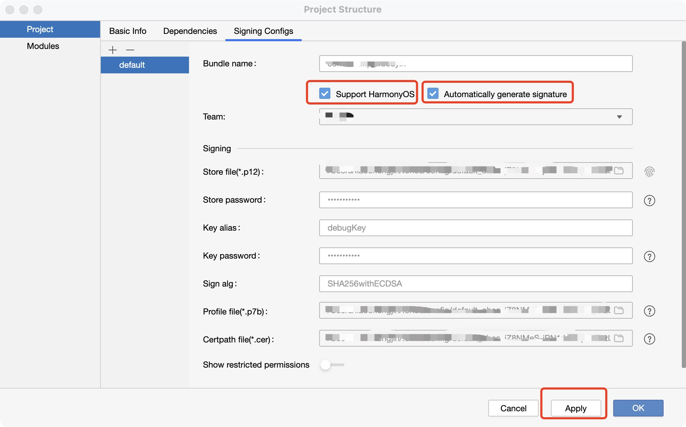

#### 3.3.2 OpenHarmony真机运行Flutter项目

通过`flutter devices`指令发现真机设备之后，获取device-id。

方式一：进入项目目录指定构建方式编译hap包并安装到OpenHarmony手机中。

```sh
 flutter run --debug -d <deviceId>
```

方式二：进入工程根目录编译hap包,然后安装到OpenHarmony手机中。

```sh
 flutter build hap --debug
 hdc -t <deviceId> install <hap file path>
```

方式三：使用DevEcoStudio 选择设备为真机，点击启动。

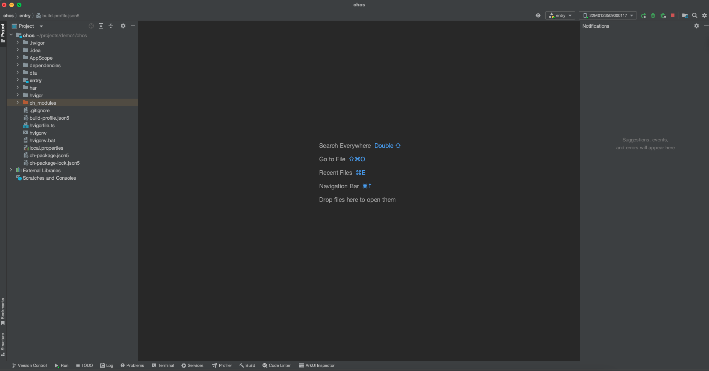

### 3.4 模拟器运行Flutter项目

#### 3.4.1 使用DevEcoStudio打开项目的ohos模块

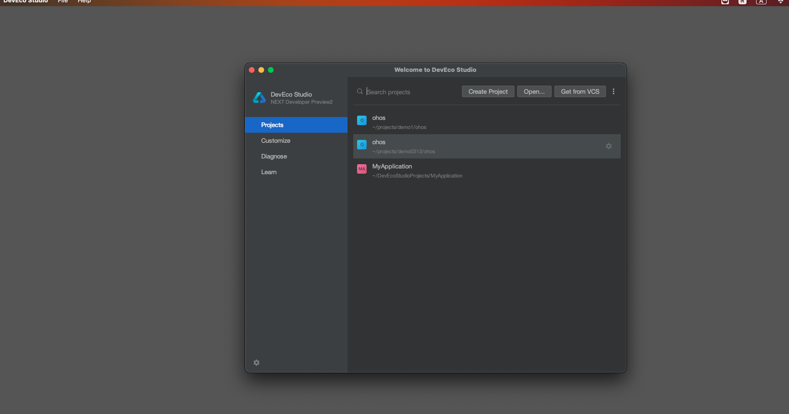

#### 3.4.2 DevEcoStudio启动OpenHarmony模拟器


切换设备为OpenHarmony模拟器

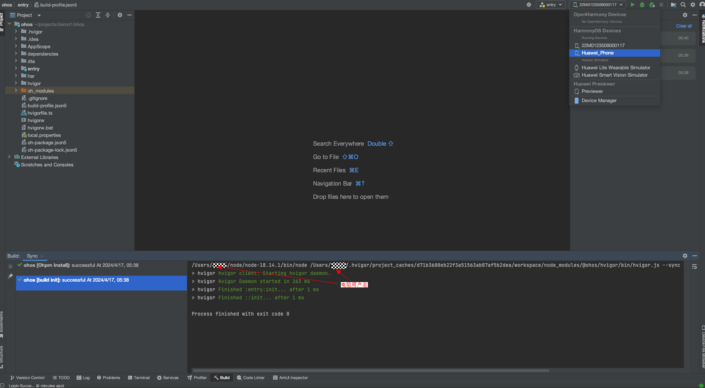

#### 3.4.3 点击编译运行

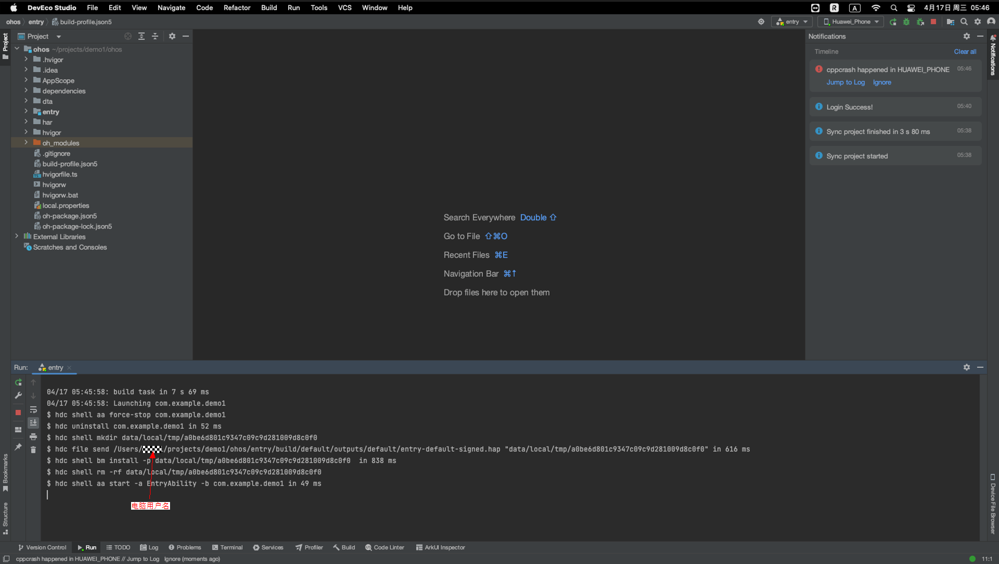


### 3.5 模拟器运行常见问题

#### 3.5.1 无法创建模拟器

情况1：使用实名制认证的账号进行签名

#### 3.5.2 Windows或Mac x86架构无法运行模拟器
 由于模拟器当前仅支持Mac arm架构，且flutter应用尚未适配x86架构，因此在Windows或Mac的x86运行模拟器会遇到限制。

### 3.6 pub upgrade常见问题

#### 3.6.1 pub upgrade耗时较长

情况1：首次加载因为需要拉取的文件较多，根据自身网络情况所需花费的时间有较大差异，请耐心等待,如果下载失败，建议检查网络连接或更换代理后再次尝试。

情况2：删除 `flutter_flutter/bin/cache` 文件后重试。

情况3：更换镜像源，如：

```
PUB_HOSTED_URL=https://mirrors.tuna.tsinghua.edu.cn/dart-pub
FLUTTER_STORAGE_BASE_URL=https://mirrors.tuna.tsinghua.edu.cn/flutter
```