# OpenHarmony Flutter Environment Setup

## Environment Preparation

### 1. Downloading and Installing the Latest DevEco Studio Development Suite and Its Dependencies

#### 1.1 Official Download URL
Official download address of the OpenHarmony development suite: https://developer.huawei.com/consumer/cn/download/
  ```
 Note:
(1) The development suite is supported in Linux, macOS, and Windows systems.
(2) For macOS, enter "uname -m" on the terminal to determine the system architecture and select the corresponding development suite.
     If the output is x86_64, the system uses the X86-64 architecture.
     If the output is arm64, the system uses the ARM64 architecture.
  ```

#### 1.2 Download List

##### (1) Download the latest version of DevEco Studio based on your computer system.

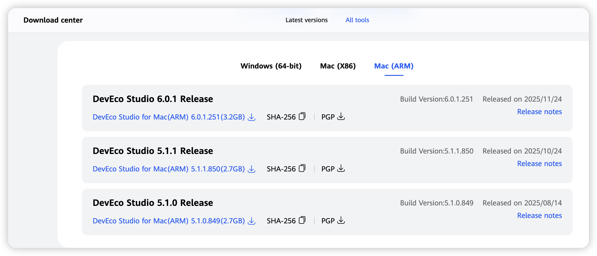


##### (2) Download an Emulator in DevEco Studio if no real OpenHarmony device is available.
For details about how to download and install the Emulator, see section 2.2 "Install an Emulator."

##### (3) Download OpenHarmony Flutter.
 Project URL: https://gitcode.com/openharmony-tpc/flutter_flutter

 Use a code editor to download the repository to your local PC and specify the dev or master branch. The dev branch is continuously updated and has more features than the master branch.
  ```
  1 git clone https://gitcode.com/openharmony-tpc/flutter_flutter.git
  2 git checkout -b dev origin/dev
  ```
#####  (4) (Optional) Download the Flutter Engine build products.
* To build Hap, simply execute the command flutter build hap; there is no longer a need for the --local-engine parameter, and you can directly obtain the compiled product from the cloud.

#### 1.3 Preinstalled Environment Dependencies
* The OpenHarmony SDK requires the Java environment. You can download JDK 17 from the [Oracle website](https://www.oracle.com/java/technologies/downloads/#java17) or OpenJDK website and set the environment.
* Execute the following instruction to check the JDK installation result:
```sh
java -version
```

### 2. How to Install

#### 2.1 Decompress the component suite package and install the DevEco Studio.


#### 2.2 Install an Emulator.

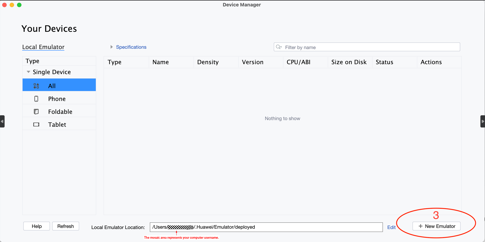
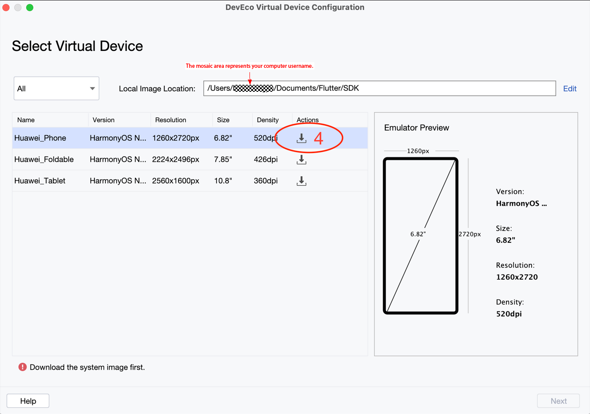
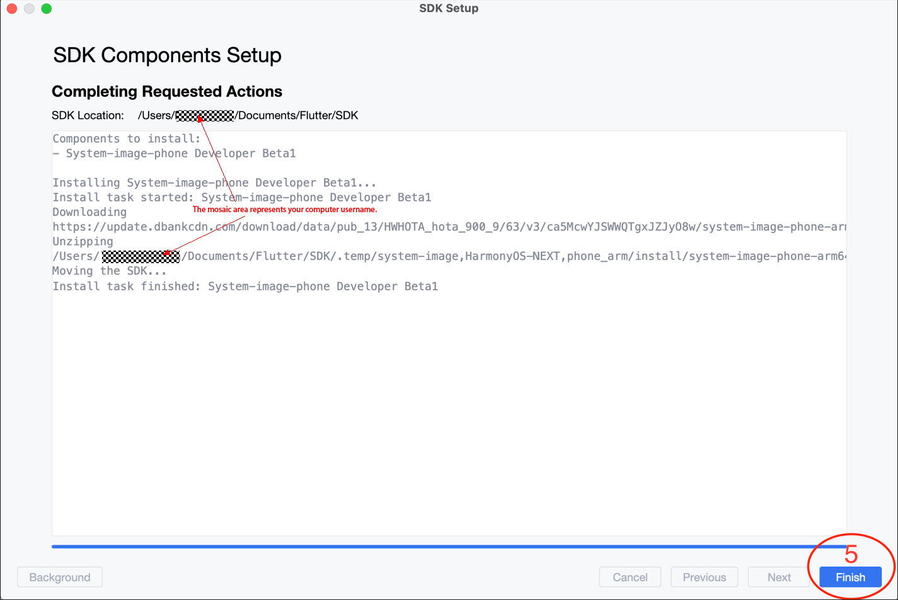

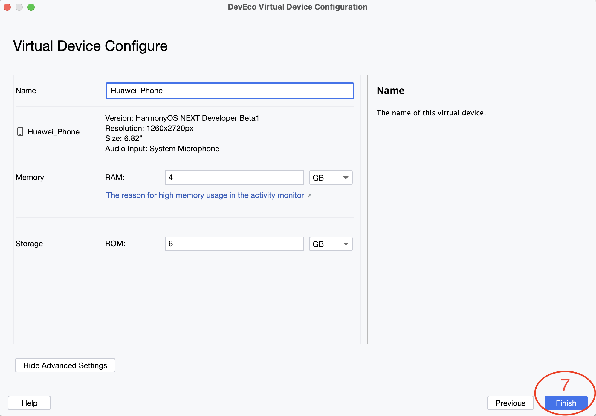

#### 2.3 Configure environment variables.
* Use the terminal tool to determine the storage path of the actual environment variables in the current system. Execute the following instruction:
```sh
echo $SHELL 
```
* If the output is `/bin/bash`, execute the following instruction to open the **.bash_profile** file:
```sh
vi ~/.bash_profile
```
* If the output is `/bin/zsh`, execute the following instruction to open the **.zshrc** file:
```sh
vi ~/.zshrc
```
* After you get the environment variable storage file, configure the environment variables. For example, open the **bash_profile** file and execute the `vi ~/.bash_profile` instruction.
```sh

# Mirror inside China
export PUB_HOSTED_URL=https://pub.flutter-io.cn
export FLUTTER_STORAGE_BASE_URL=https://storage.flutter-io.cn

# flutter_flutter/bin directory pulled from Flutter pub
export PATH=/Users/admin/ohos/flutter_flutter/bin:$PATH

# OpenHarmony SDK
export TOOL_HOME=/Applications/DevEco-Studio.app/Contents # macOS environment
export DEVECO_SDK_HOME=$TOOL_HOME/sdk # command-line-tools/sdk
export PATH=$TOOL_HOME/tools/ohpm/bin:$PATH # command-line-tools/ohpm/bin
export PATH=$TOOL_HOME/tools/hvigor/bin:$PATH # command-line-tools/hvigor/bin
export PATH=$TOOL_HOME/tools/node/bin:$PATH # command-line-tools/tool/node/bin
export HDC_HOME=$TOOL_HOME/sdk/default/openharmony/toolchains # (Optional) hdc instruction

# Optional configuration items (required when using the Android Studio or Visual Studio Code to debug. The JDK version is 17.0.12)
JAVA_HOME=/Users/admin/Documents/JDK/jdk-17.0.12.jdk/Contents/Home
PATH=$JAVA_HOME/bin:$PATH:.
export JAVA_HOME
export PATH

# Optional configuration item (to prevent the creation of subsequent Flutter projects from being affected by the mismatched environment variable of the Gitee download URL for OpenHarmony Flutter)
export FLUTTER_GIT_URL=https://gitcode.com/openharmony-tpc/flutter_flutter.git

# Optional configuration item (required only when there is no node environment in the tool file under the command-line-tools directory)
# export NODE_HOME=/Users/admin/node/node-18.14.1
# export PATH=$PATH:$NODE_HOME/bin
```
* After all required environment variables are configured, execute the following instruction to update the environment configuration for making it take effect:
```sh
source ~/.bash_profile
```

#### 2.4 Run the Emulator.

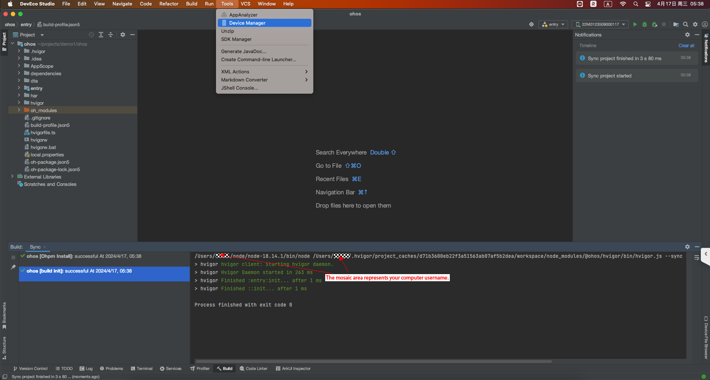

Create an Emulator.

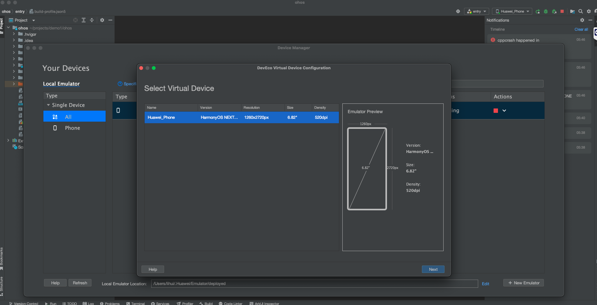

Start the Emulator.

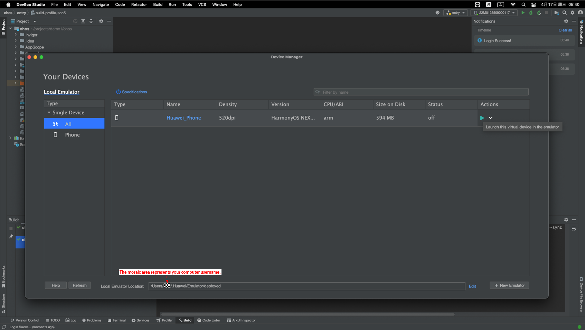

Emulator running effect


## OpenHarmony Flutter Integration and Debugging

### 1. Checking the Environment
Run `flutter doctor -v` to check whether the environment variable configuration is correct. The check results for both Flutter and OpenHarmony should be **ok**. If there are any prompts indicating missing environment variable configuration, follow the prompts to configure the environment.

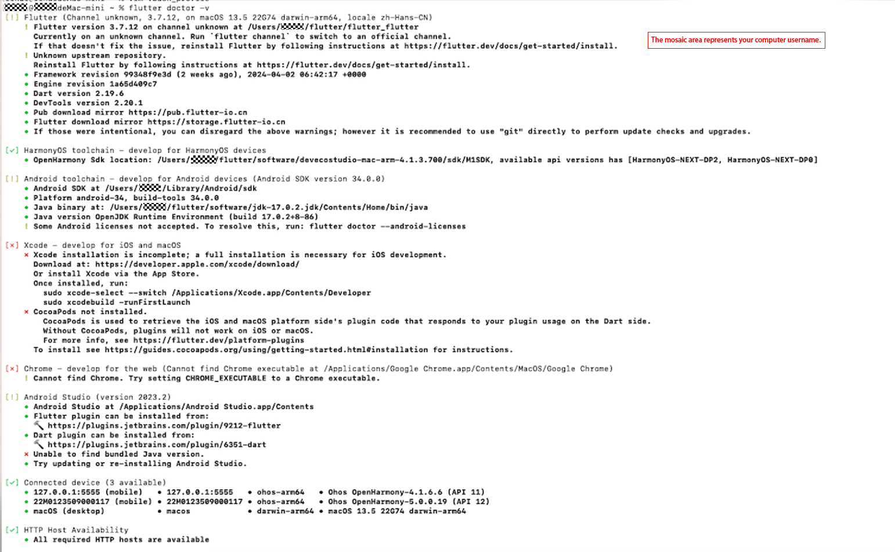


### 2. Creating a Flutter Project
Create a project and build it. You can find the build products in **${projectName}/ohos/entry/build/default/outputs/default/entry-default-signed.hap**.

```sh
# Method 1 for project creation: Only the ohos platform is created.
flutter create --platforms ohos <projectName> 

# Method 2 for project creation: Android, iOS, and ohos platforms are created.
flutter create  <projectName> 

# Go to the root directory of the project and compile the HAP.
flutter build hap --debug
```

### 3. Running the Flutter Project on a Real OpenHarmony Device
#### 3.1 Sign the project.
Before running the project on a real device, you need to sign the project. Steps are as follows.
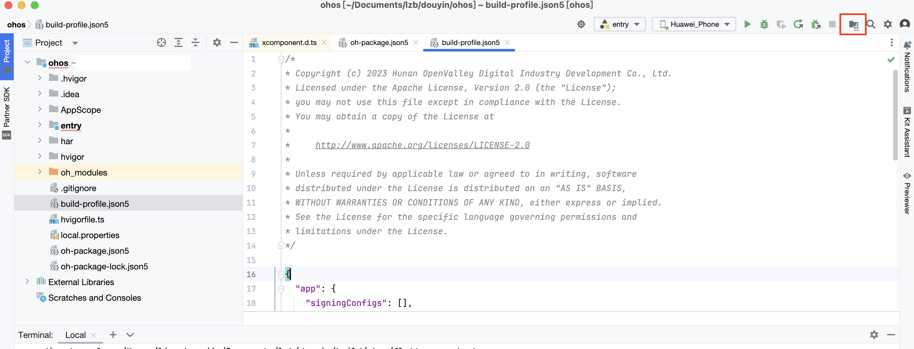


#### 3.2 Run the project on a real device.
* Execute the `flutter devices` instruction to discover a real device and obtain the device ID.

Method 1: Go to the project directory, compile the HAP in the specified build mode, and install it on the OpenHarmony device.
```sh
 flutter run --debug -d <deviceId>
```

Method 2: Go to the project root directory, compile the HAP, and install it on the OpenHarmony device.
```sh
 flutter build hap --debug
 hdc -t <deviceId> install <hap file path>
```

Method 3: Use DevEco Studio to set your phone as the real device and start running.
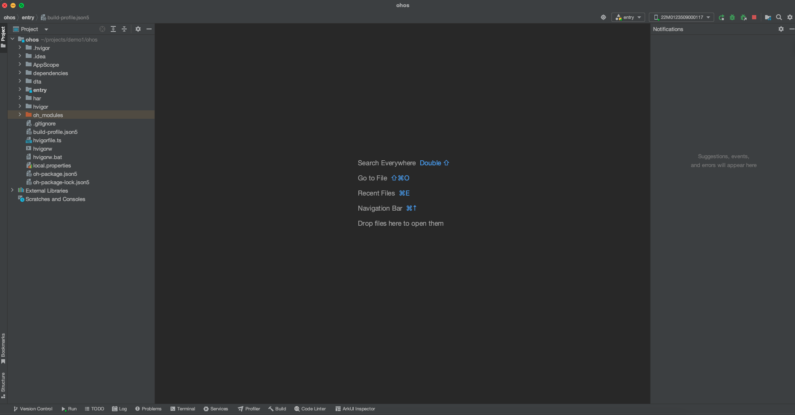

### 4. Running the Flutter Project on an Emulator

#### 4.1 Use DevEco Studio to open the ohos module of the project.

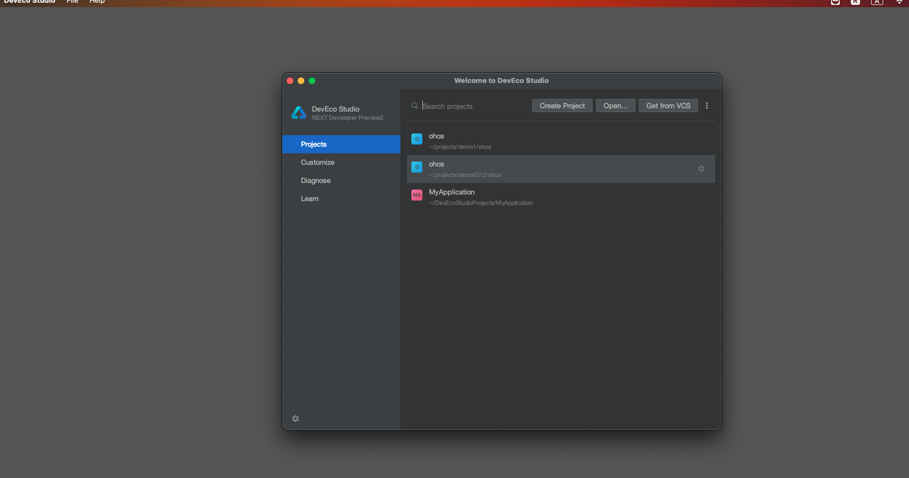

#### 4.2 Start the OpenHarmony Emulator in DevEco Studio.


Switch to the OpenHarmony Emulator.

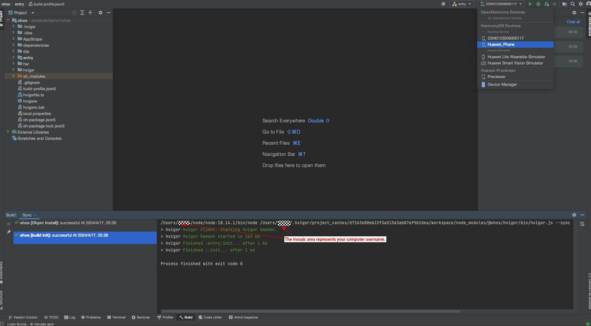

#### 4.3 Compile and run.

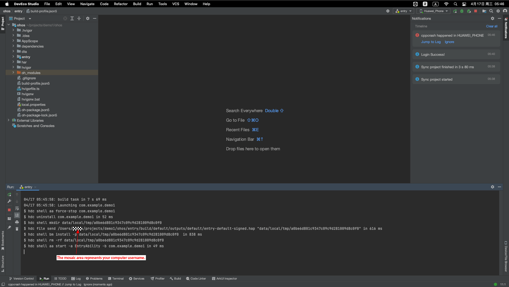


### 5. FAQs on Emulator Running

#### 5.1 Unable to Create an Emulator
Case 1: Use an account that has passed real-name authentication to sign in.

#### 5.2 Unable to Run the Emulator on Windows or macOS x86 Architecture
Currently, the Emulator supports the macOS ARM architecture, and Flutter has not been adapted to the x86 architecture. Therefore, you cannot run the Emulator on Windows or Mac x86 architecture.

### 6. FAQs on pub upgrade Instruction

#### 6.1 Executing the pub upgrade Takes a Long Time
Case 1: A large number of files need to be pulled for the first loading. The time required varies according to the network status. If the download fails, check the network connection or replace the proxy, and try again.

Case 2: Delete the **flutter_flutter/bin/cache** file and try again.

Case 3: Replace the source of the mirror. Example:
  PUB_HOSTED_URL=https://mirrors.tuna.tsinghua.edu.cn/dart-pub
  FLUTTER_STORAGE_BASE_URL=https://mirrors.tuna.tsinghua.edu.cn/flutter

