Flutter OHOS外接纹理适配简介

Flutter在OHOS平台使用外接纹理，视频播放和相机预览使用方法是一致的，在注册纹理时，flutter engine返回surfaceId。图片场景，则是以PixelMap的形式注册到flutter engine。

注：  
1. 一般而言，为了方便复用，会将ohos对接flutter外接纹理的功能代码作为一个module模块组件单独写一个插件注册到Flutter engine，见视频播放的demo：[video_player_ohos](https://gitcode.com/openharmony-tpc/flutter_packages/tree/master/packages/video_player/video_player_ohos/example)。

2. Flutter3.7：外接纹理背景色默认为白色，支持修改：[Flutter OHOS外接纹理第一帧（背景）自定义](<./Flutter OHOS外接纹理第一帧（背景）自定义.md>)。

   Flutter3.22/3.27：没有默认设置外接纹理背景色，支持按3.7上述方法设置。

# 相机预览

## Demo地址：[test_camera](https://gitcode.com/openharmony-tpc/flutter_samples/tree/master/ohos/testcamera)

## 实现说明

1． 实现插件，在onAttachedToEngine中，从入参FlutterPluginBinding中获取TextureRegistry。

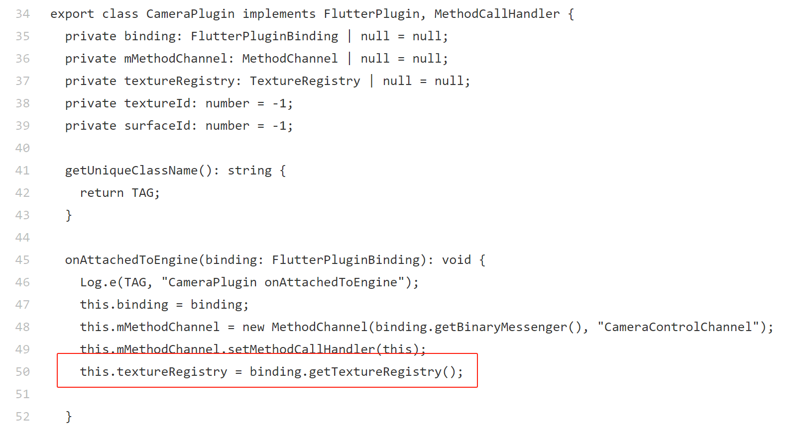

2． 在onMethodCall中实现注册纹理的响应方法。

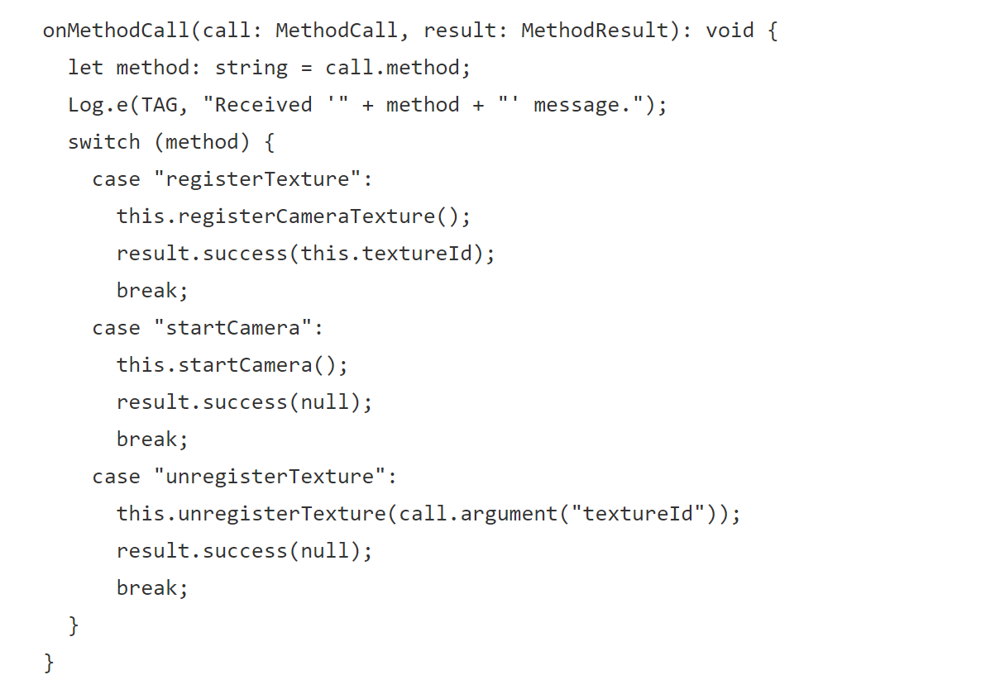

registerCameraTexture中实现注册纹理，先获取textureId，再使用该textureId去注册纹理到flutter engine，返回surfaceId。

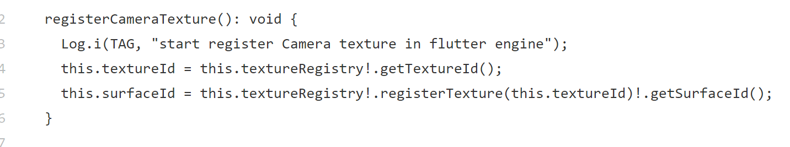

3． 在启动相机预览中，使用前面获取到的surfaceId。

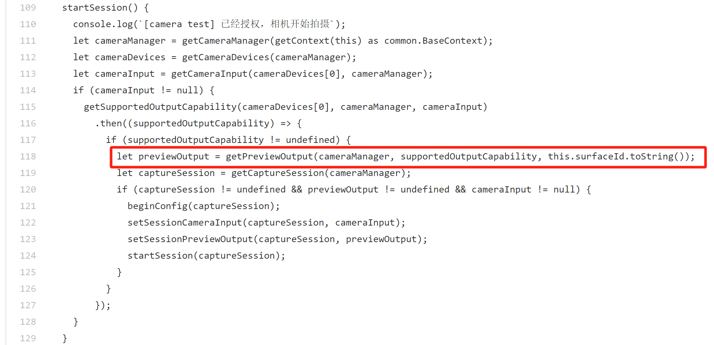

4 . dart侧通过MethodChannel触发，触发纹理注册和启动相机预览。

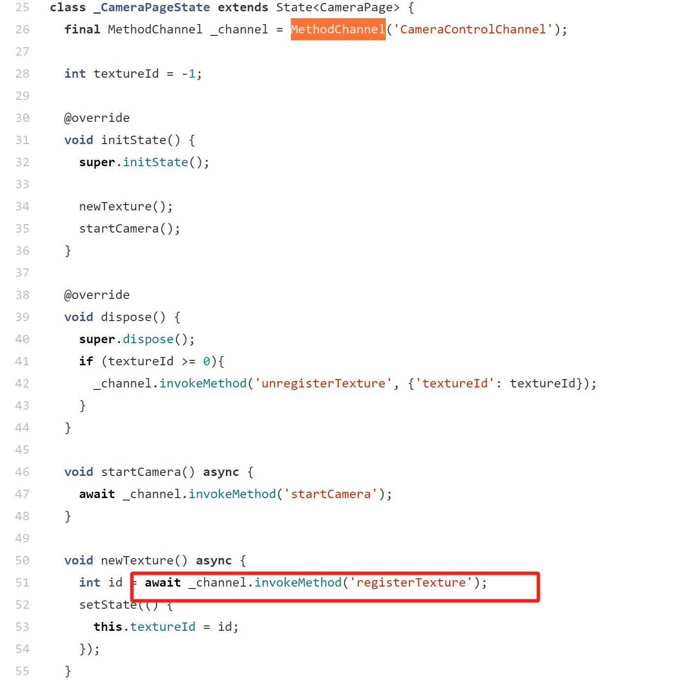

预览画面使用获取到的textureId构造一个texture widget。

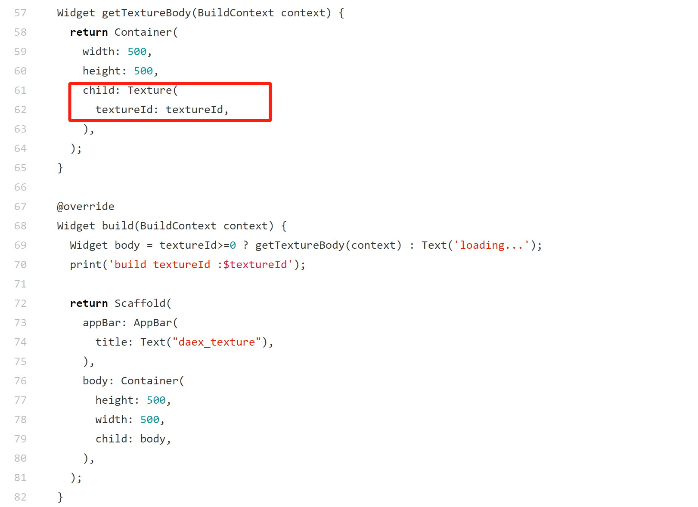

# 视频播放

## Demo地址：[video_player](https://gitcode.com/openharmony-tpc/flutter_packages/tree/master/packages/video_player/video_player_ohos/example)

## 实现说明

视频播放和相机预览使用纹理方式完全一致，简述如下：

1.  在video_player_ohos插件中实现ohos原生播放器：AVplayer。可参考[文档](https://docs.openharmony.cn/pages/v5.0/zh-cn/application-dev/media/media/using-avplayer-for-playback.md)。
2.  同样实现插件，在onAttachedToEngine中，从入参FlutterPluginBinding中获取TextureRegistry（此处放入FlutterState中封装）。

    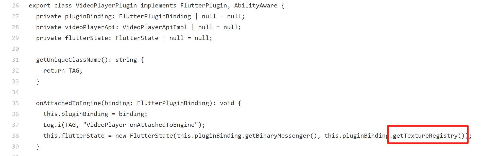

3.  在创建视频播放器的方法中，（先从FlutterState拿出TextureRegistry）同样的先获取textureId，再注册纹理到engine，得到surfaceId（surfaceId在返回的SurfaceTextureEntry对象中）：

    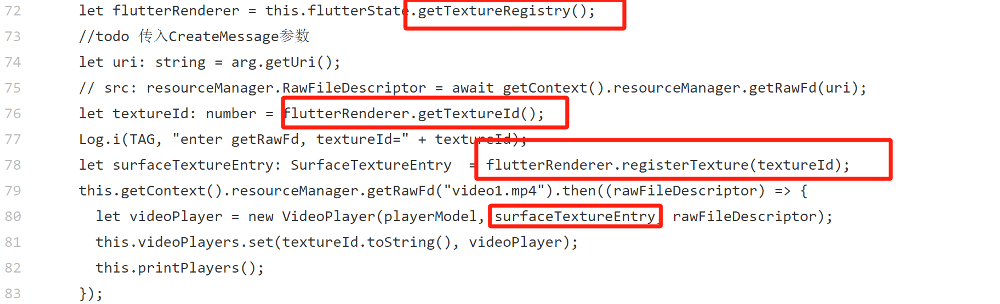

4.  Videoplaye构造方法中取出surfaceId：

    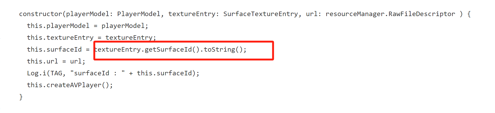

5.  在AVplayer是AvplayerStatus.INITIALIZED状态时，把surfaceId赋给AVplayer。

    

1.  第三步创建AVplayer时，需要把textureId返回给dart层，dart层得到该值，可以在texture Widget中使用该外接纹理完成渲染。

# 图片显示

## Demo地址：[test_picture](https://gitcode.com/openharmony-tpc/flutter_samples/tree/master/ohos/testpicture)

## 使用说明

图片外接纹理，不需要使用surfaceId, 而是以PixelMap的形式注册到flutter engine。

1.  同样实现插件，在onAttachedToEngine中，从入参FlutterPluginBinding中获取TextureRegistry。

    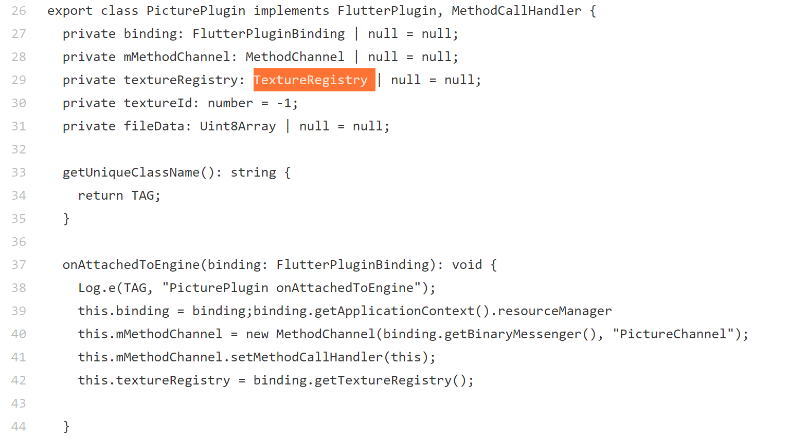

2.  在onMethodCall中实现注册纹理的响应方法。

    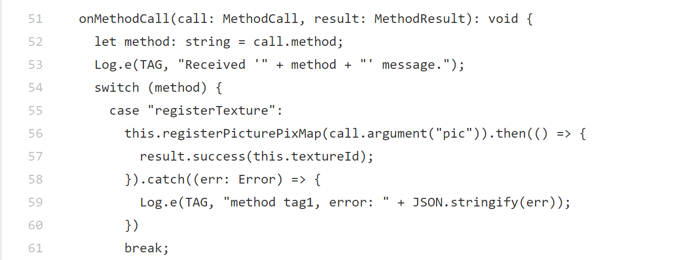

3.  注册纹理实现方法中，把图片数据读进来，创建ImageSource，再创建PixelMap对象，使用registerPixelMap接口注册纹理到flutter engine，得到textureId返回给dart层。

    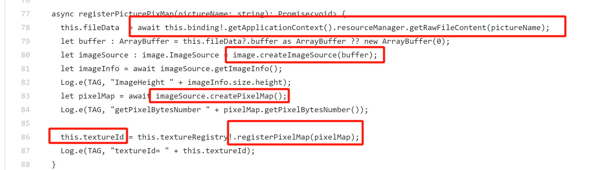

4.  dart层得到该值，可以在texture Widget中使用该外接纹理完成渲染。

    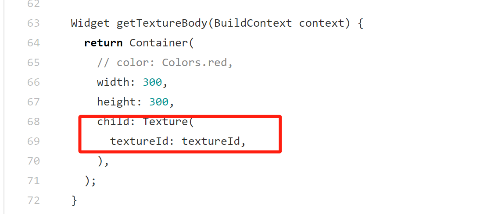
