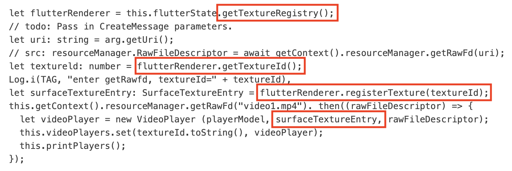

External Texture Adaptation for Flutter

Flutter uses external textures on the ohos platform. In the case of camera preview and video playback, the Flutter engine returns a surface ID when a texture is registered. In the case of image display, a texture is registered with the Flutter engine in the form of a PixelMap.

**NOTE** 1. Generally, to facilitate code reuse, the function code for connecting the ohos platform to the Flutter external texture is encapsulated as a module, and the module is registered as a plugin with the Flutter engine. For details, see [video_player_ohos](https://gitcode.com/openharmony-tpc/flutter_packages/tree/master/packages/video_player/video_player_ohos/example).

2. Flutter 3.7: The default background color of the external texture is white and can be changed: [External Texture First Frame (Background) Customization for Flutter](<./external-texture-first-frame-(background)-customization-for-flutter.md>).

   Flutter 3.22/3.27: No default background color is set for the external texture, but it can be set using the same method as in 3.7.
   
# Camera Preview

## Demo URL: [test_camera](https://gitcode.com/openharmony-tpc/flutter_samples/tree/master/ohos/testcamera)

## How to Implement

1. Obtain **TextureRegistry** from the **FlutterPluginBinding** input parameter in **onAttachedToEngine** to implement the plugin.

2. Implement the response method for texture registration in **onMethodCall**.

In **registerCameraTexture** used to register a texture, obtain the texture ID, and then register the texture based on the texture ID with the flutter engine to obtain a surface ID.

3. Use the obtained surface ID when starting camera preview.

4 . Call **MethodChannel** at the dart layer to trigger texture registration and start camera preview.

Use the obtained texture ID to build a texture widget for image preview.

# Video Playback

## Demo URL: [video_player](https://gitcode.com/openharmony-tpc/flutter_packages/tree/master/packages/video_player/video_player_ohos/example)

## How to Implement

Video playback uses the same way as camera preview in registering a texture. Steps are as follows:

1.  Implement the native ohos player AVplayer in the **video_player_ohos** plugin. For details, see [Using AVPlayer to Play Audio (ArkTS)](https://docs.openharmony.cn/pages/v5.1/en/application-dev/media/media/using-avplayer-for-playback.md).
2.  Obtain **TextureRegistry** from the **FlutterPluginBinding** input parameter in **onAttachedToEngine** to implement the plugin (encapsulated in **FlutterState**).

    

3.  In the method for creating a video player, you should obtain the texture ID first (from **TextureRegistry** in **FlutterState**), then register the texture with the engine, and obtain the surface ID from the returned **SurfaceTextureEntry** object.

    

4.  Obtain the surface ID from the video player constructor.

    

5.  When the AVplayer is in the **AvplayerStatus.INITIALIZED** state, the surface ID is assigned to the AVplayer.

1.  When the AVplayer is created in step 3, the texture ID needs to be returned to the dart layer. Then the dart layer can use the external texture to complete rendering in the texture widget.

# Image Display

## Demo URL: [test_picture](https://gitcode.com/openharmony-tpc/flutter_samples/tree/master/ohos/testpicture)

## How to Implement

In the case of image display, no surface is used for connection to the external texture. The texture is registered with the Flutter engine in the form of a PixelMap.

1.  Obtain **TextureRegistry** from the **FlutterPluginBinding** input parameter in **onAttachedToEngine** to implement the plugin.

    

2.  Implement the response method for texture registration in **onMethodCall**.

    

3.  In the texture registration method, pass in image data to create an **ImageSource** object and then a **PixelMap** object. Then call **registerPixelMap** to register the texture with the Flutter engine, obtain a texture ID, and return it to the dart layer.

    

4.  Use the external texture in the texture widget for rendering.

    
