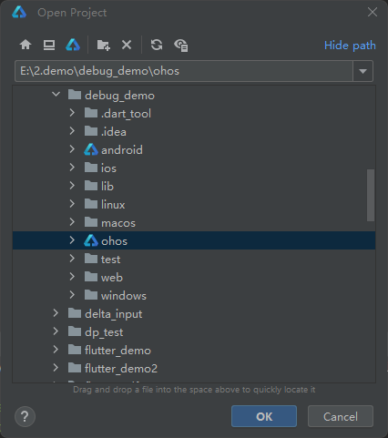
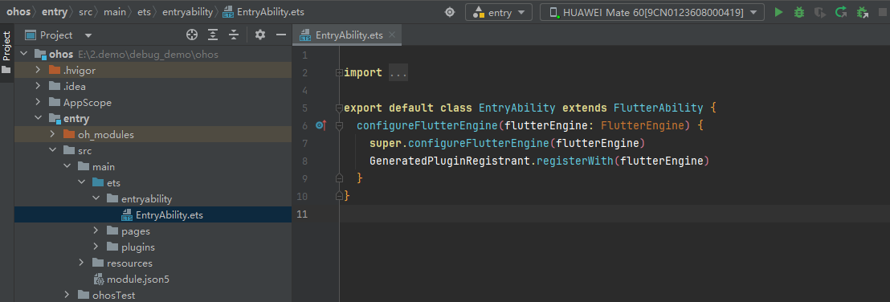
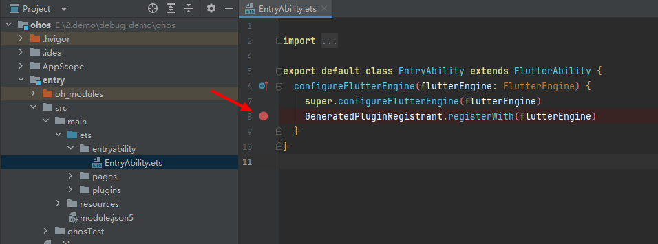
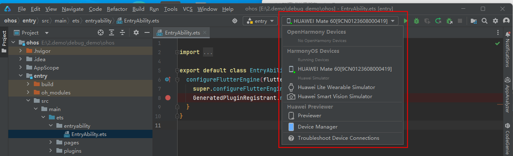
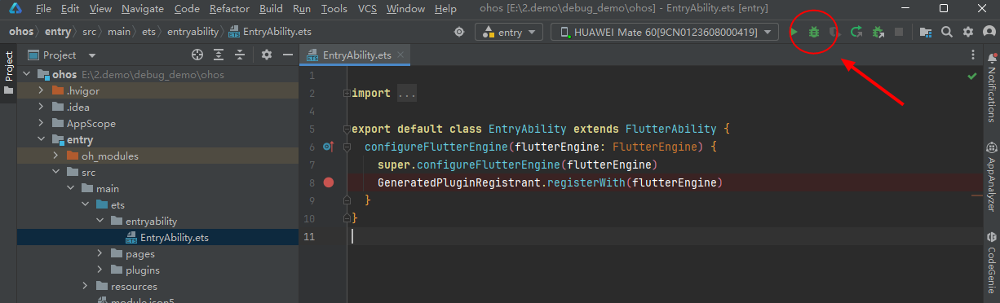
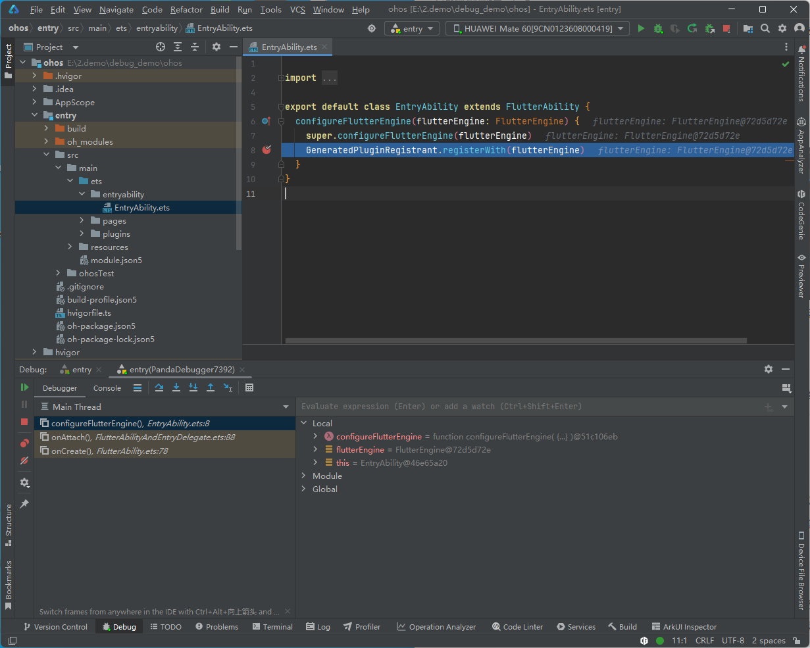
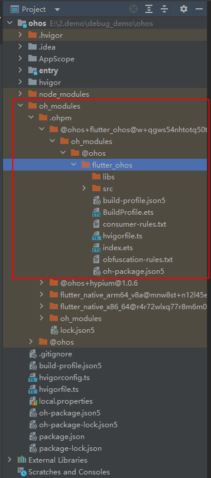
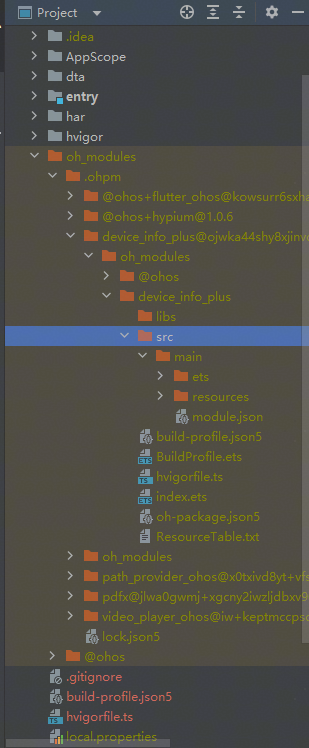

# OpenHarmony版Flutter原生代码断点调试指导

## 一、前置条件

- 已安装 DevEco Studio
- 已创建Flutter OH 应用项目

---

## 二、调试项目ohos平台化代码

### 1.打开Flutter项目的ohos目录

- 使用 DevEco Studio 工具，打开 Flutter 项目的 ohos 目录

  

- 打开需要调试的文件

  

### 2. 设置断点

- 在代码行号左侧单击，出现红色圆点即为断点

  

- 可在函数入口、变量赋值、事件回调等关键位置设置断点

### 3. 启动调试

- 选择真机或模拟器作为运行目标

  

- 点击工具栏上的“调试”按钮（绿色虫子图标）

  

- 工程自动编译并部署，程序运行到断点处自动暂停

   

---

## 三、调试 Flutter ohos平台缓存代码

### 1. 调试 Flutter SDK ohos适配层缓存代码

- 打开Flutter SDK ohos 适配层缓存路径

  路径： `project\ohos\oh_modules\.ohpm\@ohos+flutter_ohos\oh_modules\@ohos\flutter_ohos`

- 打开需要调试的sdk缓存文件，按照上述第二步进行调试

### 2. 调试 Flutter OH应用使用的三方库缓存代码

- 三方库ohos适配层缓存代码，在 `project\ohos\oh_modules\.ohpm\` 路径下

  

- 打开需要调试的三方库代码，按照上述第二步进行调试

---

## 四、常见问题与解决

1. **断点未命中**
   - 检查是否为 debug 编译
   - 确认断点设置在实际执行路径上

2. **无法进入 ArkTS 代码**
   - 检查 ArkTS 文件是否正确编译并部署

3. **调试卡顿或闪退**
   - 建议使用真机调试，模拟器性能有限

---

## 五、参考资料

- [DevEco Studio ArkTS 调试官方文档](https://developer.huawei.com/consumer/cn/doc/harmonyos-guides/ide-debug-arkts)
