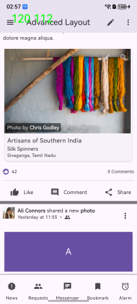
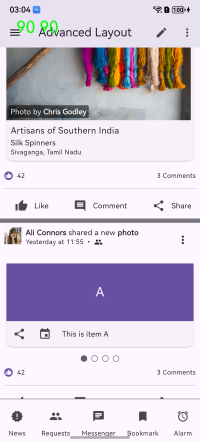
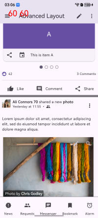

# 1.简介
LTPO功能是指屏幕动态帧率，在屏幕刷新率设置为“智能”时，应用可根据当前场景自动切换合适的帧率。

Flutter框架帧率现状：在屏幕刷新率设置为“智能”时，其帧率策略与屏幕刷新率设置为“高”时一致。手指触摸屏幕时，屏幕刷新率为120帧；手指离开屏幕后，屏幕刷新率保持3s的120帧；3s后无操作，屏幕刷新率降低为60帧。

注意：LTPO特性依赖OpenHarmony API 20，请在API 20及以上的ROM中验证。

# 2.适配场景
|  序号   | 场景  |
|  ----  |  ----  |
| 1 | 自定义平移动画 |
| 2 | 转场平移动画 |
| 3 | 滚动列表抛滑 |
| 4 | 轮播图 |

# 3.应用适配依赖

|  依赖顺序   | 依赖项  |  说明  |
|  ----  |  ----  |  ----  |
| 1 | [deveco-studio](#deveco-studio) | IDE工具 |
| 2 | [flutter_flutter](#flutter-flutter) | 集成了LTPO功能的flutter sdk |
| 3 | [LTPO配置文件](#frames-config) | 配置LTPO功能开关和帧率策略 |
| 4 | [匹配版本要求](#version-requirement) | 系统能力支持的最低版本 |


# 4.详情

## 4.1 <span id="deveco-studio">deveco-studio</span>
deveco-studio需要更新新版本，点击下方链接下载最新DevEco Studio.

链接：https://developer.huawei.com/consumer/cn/download/deveco-studio

## 4.2 <span id="flutter-flutter">flutter_flutter</span>
LTPO功能跟随flutter_flutter代码仓版本发布，请使用flutter_flutter代码仓的3.27.5-ohos-1.0.2分支进行具备LTPO功能的flutter应用开发。

链接：https://gitcode.com/openharmony-tpc/flutter_flutter/tree/3.27.5-ohos-1.0.2

## 4.3 <span id="frames-config">LTPO配置文件</span>

LTPO配置文件有动态帧率开关，平移动画的帧率映射表，以及缩放和旋转的帧率映射表。
|  子项   | 描述  |  类型  |
|  ----  |  ----  |  ----  |
| SWITCH | 动态帧率开关 | 整型。0-关闭；1-开启 |
| TRANSLATE | 平移动画的帧率映射表，<br>不建议修改帧率映射表中的元素。 | 数组。每个元素由序号、最小速度、最大速度、期望帧率组成。 |
| SCALE | 平移动画的帧率映射表，<br>不建议修改帧率映射表中的元素。<br>当前未实现 | 数组。每个元素由序号、最小速度、最大速度、期望帧率组成。 |
| ROTATION | 平移动画的帧率映射表，<br>不建议修改帧率映射表中的元素。<br>当前未实现 | 数组。每个元素由序号、最小速度、最大速度、期望帧率组成。 |


当前帧率映射表如下：
|  序号   | 最低滑动速度  |  最高滑动速度  |  帧率  |
|  ----  |  ----  |  ----  | ----  |
|  1  |  800  |  无限大  | 90  |
|  2  |  77  |  800  | 120  |
|  3  |  46  |  77  | 90  |
|  4  |  10  |  46  | 72  |
|  5  |  0  |  10  | 60  |

注意：实际屏幕帧率由系统决策。

配置文件framesconfig.json，存放在ArkUI应用工程中Flutter模块的src/main/resources/rawfile目录下，与flutter_assets同级目录。

详细说明：
1) framesconfig.json是LTPO的配置文件，可配置使能开关，当前默认使能。
2) 配置文件预置了平移动画的速率映射帧率挡位，根据动画的平移速率来决定屏幕刷新率。默认映射帧率挡位配置，不推荐改动。
3) 配置文件预置在模板应用工程中，默认存在新建的flutter应用工程中。已存在的flutter应用工程，需要适配切换flutter 3.27版本或更高版本，并手动拷贝framesconfig.json文件到应用工程ohos/entry/src/main/resources/rawfile路径下。
  
其原型文件在  
https://gitcode.com/openharmony-tpc/flutter_flutter/blob/3.27.5-ohos-1.0.2/packages/flutter_tools/templates/app_shared/ohos.tmpl/entry/src/main/resources/base/profile/framesconfig.json

## 4.4 <span id="version-requirement">匹配版本要求</span>
打开“设置”，进入“关于本机”，查看软件版本是否为《6.0.0.110（SP96C00E110R4P8）》及以上。


# 5.适配流程

1) 更新[deveco-studio](#deveco-studio)的IDE工具，至少使用DevEco Studio 6.0.0 Release版本，其中包含所依赖的api 20接口。
2) 下载适配了LTPO功能的[flutter_flutter](#flutter-flutter)代码仓，并添加进环境变量。
3) 命令行窗口执行"flutter doctor -v"，确认flutter路径是否为适配了ltpo功能的flutter_flutter代码仓，其分支是否为3.27.5-ohos-1.0.2及以上，确保适配应用是flutter 3.27 版本的。
4) 应用工程里的ltpo配置文件[framesconfig.json](#frames-config)确认是否存在。如果是新建的flutter应用工程，ltpo配置文件默认存在应用模板里；如果是已存在的应用工程，需要手动拷贝framesconfig.json文件到应用工程ohos/entry/src/main/resources/rawfile路径下。
5) 确认LTPO配置文件使能开关打开。请查看framesconfig.json文件“SWITCH”选项是否为1，不为1则修改为1。


# 6.验证流程

1) 检查手机版本是否匹配版本要求。不匹配的情况下，联系接口人推送系统版本。
2) 当前系统有帧率策略管控，需要联系接口人进行系统帧率策略云推。
3) 开启“智能”刷新。“设置” > “显示和亮度” > “屏幕刷新率”。
4) 开启“显示刷新频率”。“设置” > “系统” > “开发者选项”，调试那一栏下。开启后左上角显示两个数字，左侧为帧率挡位，即期望帧率；右侧为实时帧率。主要关心左侧的数字。（如果只有一个数字，即为帧率挡位）
5) 打开应用中带有Flutter框架的滚动组件页面。
6) 页面抛滑。
7) 观察抛滑过程，可以看到显示帧率根据页面滑动速度从120fps先降低到90fps，最后停止滑动后降低到60fps。如下图所示：  





# 7.常见问题

## 动画页面切换后台，动画未暂停，仍然在执行。屏幕刷新率未下降。
  
有以下建议：

### 合理选择标签页页面的TabController
TabController的创建有两种形式，一种是使用系统的DefaultTabController，第二种是自己定义一个TabController实现SingleTickerProviderStateMixin。

1) 无状态控件(StatelessWidget)搭配DefaultTabController
2) 有状态控件(StatefulWidget)搭配TabController

```
// 示例代码
class TabsPage  extends StatefulWidget {
  @override
  State<TabsPage> createState() => _TabsPageState();
}

class _TabsPageState extends State<TabsPage>
    with SingleTickerProviderStateMixin {
  late TabController _tabController;

  @override
  void initState() {
    super.initState();
    _tabController = new TabController(
      vsync: this,
      length: 3 // 设置TabBarView数量
    );
  }

  @override
  void dispose() {
    _tabController.dispose();
    super.dispose();
  }

@override
  Widget build(BuildContext context) {
    ...
    TabBar(
        controller: _tabController,
        tabs: <Widget>[ ... ]
    ),
    ...
    TabBarView(
        controller: _tabController,
        children: <Widget>[ ... ]
    ),
  }
}
```

### TabView页签切换停止动画

有状态控件(StatefulWidget)生命周期deactivate，当框架从树中移除此 State 对象时将会调用此方法。可在此生命周期回调deactivate对AnimationController进行stop的操作。

如果是一个基于this的vsync周期循环的动画，重新进入页面后会自动播放，无须手动启动动画。

```
// 示例代码
class AnimationPage extends StatefulWidget {
  @override
  _AnimationPageState createState() => _AnimationPageState();
}

class _AnimationPageState extends State<AnimationPage>
    with SingleTickerProviderStateMixin {

    late AnimationController _controller;

  @override
  void deactivate() {
    super.deactivate();
    _controller.stop();
  }

  @override
  void initState() {
    super.initState();

    _controller = AnimationController(duration: Duration(seconds: 4), vsync: this)
      ..addListener(() {
        setState(() {});
      })
      ..repeat(reverse:true);

      ...
  }
}
```


# 8.参考资料

可变帧率简介
https://gitcode.com/openharmony/docs/blob/master/zh-cn/application-dev/graphics/displaysync-overview.md

基于LTPO的低功耗设计
https://developer.huawei.com/consumer/cn/doc/best-practices/bpta-ltpo-description

NativeVSync开发指导 (C/C++)
https://gitcode.com/openharmony/docs/blob/master/zh-cn/application-dev/graphics/native-vsync-guidelines.md

NativeVsync的相关函数
https://gitcode.com/openharmony/docs/blob/master/zh-cn/application-dev/reference/apis-arkgraphics2d/capi-native-vsync-h.md
