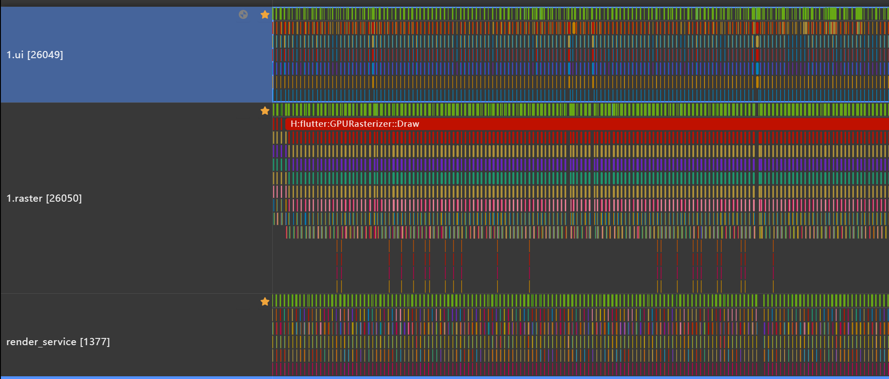
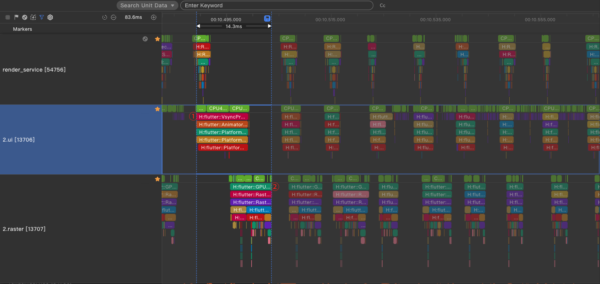

# Performance Analysis and Issue Demarcation

## Preparations
- OpenHarmony NEXT
- Flutter page running in the foreground
- Analysis Tools
  [DevEco Studio Profiler](https://developer.huawei.com/consumer/cn/download/)
  [Smartperf](https://gitcode.com/openharmony/developtools_smartperf_host)

## Introduction to Flutter Threads
Flutter uses multiple threads to complete its work. Only two of them are displayed in the overlay. All the Dart code you write runs on the UI thread. Although there is no direct access to other threads, your operations on the UI thread may affect the performance of other threads.

- Platform thread 
Main thread of the platform, where the plugin code runs. 

- UI thread 
A thread that executes Dart code in the Dart VM. This thread runs your own code and code generated by the Flutter framework based on application behavior. When an application creates and displays a scenario, the UI thread first creates a layer tree, which is a lightweight object containing device-agnostic rendering commands, and sends the layer tree to the raster thread to be rendered on the device. Do not block this thread. It is displayed at the bottom row of the performance overlay.

- Raster thread 
Also referred to as a GPU thread. This thread obtains the layer tree and delivers it to the GPU. You cannot directly access the raster thread or its data, but if the thread slows down, it must be caused by somewhere in the Dart code. The graphics library Skia runs on this thread, which is displayed on the top of the performance layer. Note that the raster thread rasterizes the GPU, but the thread itself runs on the CPU.

- I/O thread 
A thread that executes high-load operations (commonly I/O operations) to avoid blocking UI or raster threads. This thread is not displayed on the performance overlay.

- RenderService thread 
Main thread of the RS process. After Flutter renders frames, the RenderService thread combines the frames and sends them for display. In texture mode, the buffer rendered by Flutter and the application main thread are combined and sent for display together. In surface mode, the frames rendered by Flutter are separately sent for display, without being affected by the application main thread.

## Issue Demarcation
On the **Profiler** tab page at the bottom of DevEco Studio, use this the Profiler to capture application traces, and mark the UI thread, raster thread, and RenderService thread.
  

In the figure below, the RenderService loses frames because the UI thread consumes too much time for a single frame, which is expected to last approximately 8.33 ms (at the frame rate of 120 fps).

For single-frame rendering, if the total duration of UI and raster threads exceeds 8.33 ms, the performance issue is caused by Flutter. As shown in the figure above, from the start of the code execution in the ui thread (marked ①) to the end of the code execution in the raster thread (marked ②), it has exceeded one frame duration. Further performance analysis is required to demarcate the issue.

## Appendix
### Introduction to DevEco Studio Profiler
[DevEco Studio Profiler](https://developer.huawei.com/consumer/en/doc/harmonyos-guides-V2/profiler-introduce-0000001501850508-V2)

### Flutter Optimization
[Performance](https://docs.flutter.dev/perf)
