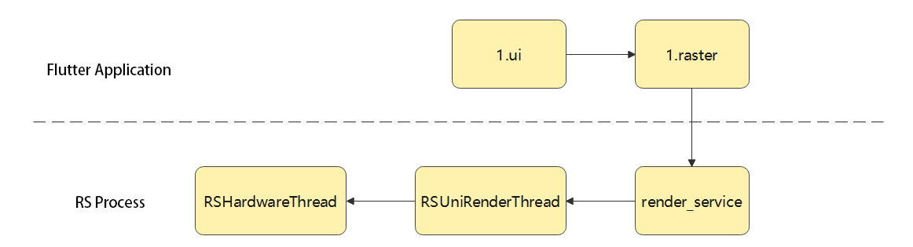
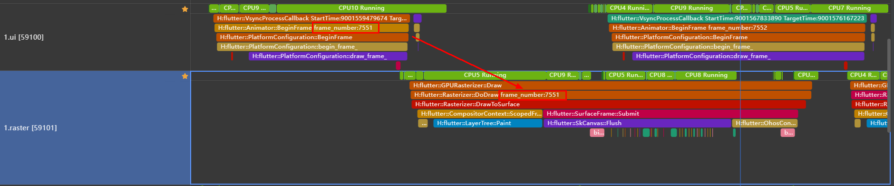
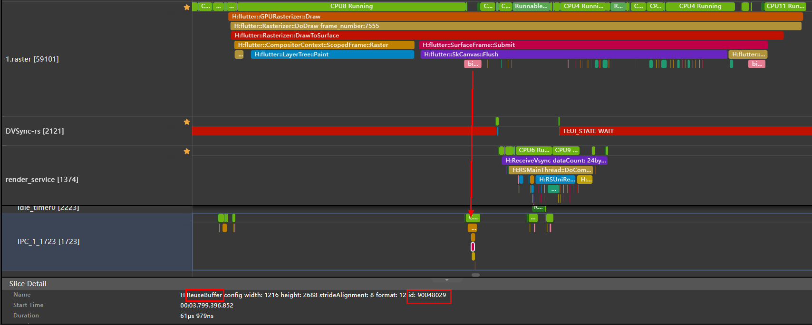

# Performance Analysis: Frame Rendering Tracing

When analyzing the performance of a Flutter application, use analysis tools to capture and analyze trace data of the application. Considering that you might need to isolate and track a particular frame, for instance, when dealing with frame freezing or loss, this topic describes how to track individual frames.  

## Analysis Tools
Common analysis tools include [DevEco Studio Profiler](https://developer.huawei.com/consumer/cn/download/) (recommended) and [Smartperf](https://gitcode.com/openharmony/developtools_smartperf_host). For details about how to use the Profiler, see [In-depth Capture for Problem Locating](https://developer.huawei.com/consumer/en/doc/harmonyos-guides-V5/deep-recording-V5).

## Frame Identifier
The rendering process of a frame is as follows.

It is important to understand the frame rendering process and assign an appropriate frame identifier to each unit to match the rendering process.

### First Identifier: frame_number
**frame_number** is the identifier for matching UI and raster threads. 
Mark these two threads, and find the identifier on the traced swimlanes. 

- If **frame_number** does not appear in the UI and raster threads, the current frame is not self-rendered by Flutter. In this case, you need to demarcate the performance issue again.

### Second Identifier: ReuseBuffer or acquire buffer

**ReuseBuffer** is the identifier for matching raster and RenderService threads. 
During the trace of **flutter::SkCanvas::Flush** in the raster thread, a buffer is applied for from the RS process to store the rendered frame content. Click the trace of **binder transaction** to jump to another thread and view the ID of the corresponding **ReuseBuffer**.

During the trace of **RSMainThread::DoComposition** in the RenderService thread, the frame memory in the buffer is obtained. The trace of **acquire buffer sequence** shows that the **ReuseBuffer** ID is the same as that applied by the raster thread.

- Based on the preceding two identifiers, you can identify the frame rendering of a Flutter application on the RS process. However, no trace is provided to identify the subsequent units in the RS process. By default, consecutive thread traces are from the same frame (for example, the traces of **render_service**, **RSUniRenderThread**, and **RSHardwareThread**).
