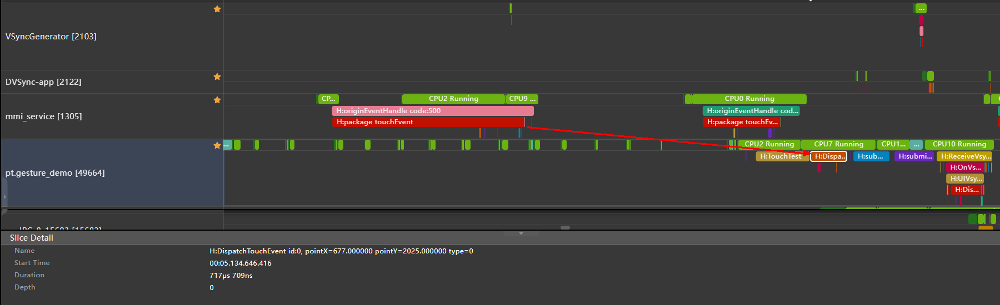
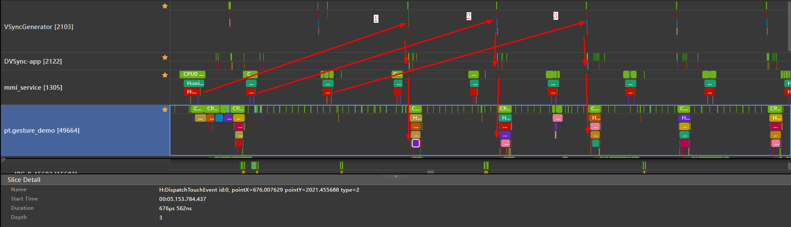
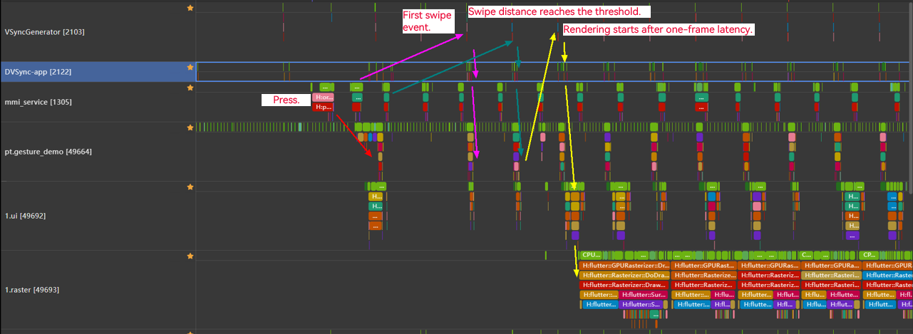
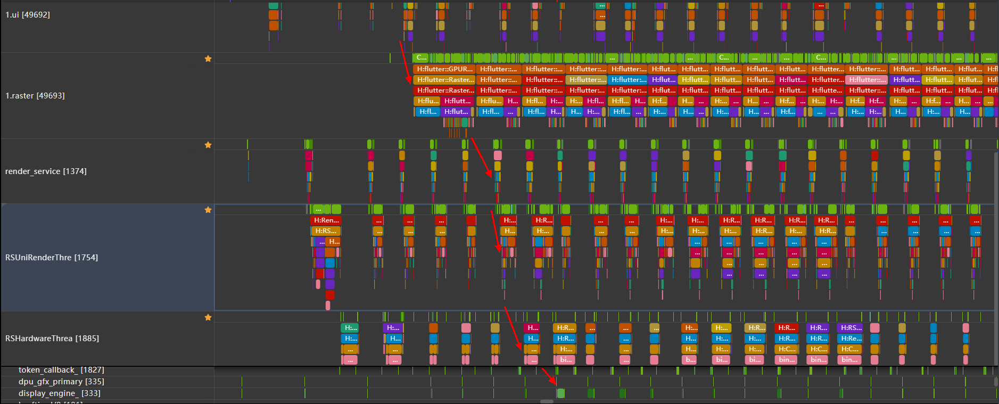

# Performance Analysis: Swipe Response Latency

This topic describes how to conduct a trace analysis on the swipe response latency for Flutter applications. You are advised to read [Performance Analysis: Sorting the Thread Sequence](./performance-threads-sequence.md) beforehand.

## Preparations

- You have learned how to use [DevEco Studio Profiler](https://developer.huawei.com/consumer/cn/download/).
- You have a clear understanding of the thread rendering sequence. For details, see [Performance Analysis: Sorting the Thread Sequence](./performance-threads-sequence.md).

## 1. Finger Press
Pressing is a prerequisite for all touch or swipe events. The system can receive important information such as the initial position of the finger and the components touched from the events.

The mmi_service thread triggers multimodal interaction events, and the Flutter application listens for and responds to touch events.

The touch event of finger press is immediately forwarded to the Flutter application.

In the mmi_service thread, following the trace of **package touchEvent**, the trace shows the details "service report touchId: number, type: down," where the type **down** indicates the touch event of finger press. In the application main thread, the trace of **DispatchTouchEvent** contains coordinates and the touch event type **0**, indicating the touch event of finger press. The traces on the two threads match.

  

## 2. Finger Swipe
The touch event of finger swipe is not immediately forwarded to Flutter applications. Instead, its sending is controlled by the VSync-app signal.

This touch event has similar traces in the mmi_service thread and the application main thread like that of finger press, yet the type is **move**, corresponding to value **2**.

The touch event of finger swipe can be passed to the main thread only after being triggered by the VSync-app signal of flutterSyncName. Therefore, the response sequence is as follows: mmi_service > VSyncGennerator > DVSync-app > application main thread. Trace sequence is as follows.

  

- Note: Coordinates of the touch event of the first finger swipe are the same as that of the touch event of finger press.

## 3. TouchSlop
TouchSlop is the minimum swipe distance that can be identified by the system. This distance is customizable, and the default value is **18**.

With the coordinates of the touch event trace in the application main thread, the system can automatically calculate whether the coordinate offset reaches the .

## 4. First Frame of the Swipe Gesture
When the swipe distance of a touch event exceeds the specified distance, the Flutter application triggers an update. However, the rendering action can be executed only after the next frame arrives. Therefore, even though the swipe gesture triggers the touch event, the first frame rendering still waits for one-frame latency.

Trace sequence is as follows.

  

## 5. First-Frame Rendering
You need to find out the corresponding trace. For details about the rendering process, see [Performance Analysis: Frame Rendering Tracing](./performance-frame-rendering-tracking.md).

Frame rendering ends on RSHardwareThread of the RS process. However, during the automatic test, the end identifier of frame rendering is the dpu_gfx_primary thread (which is a hardware signal).

Trace sequence is as follows.

  

Therefore, the swipe response latency is the duration from the time the trace of finger press is recorded in the mmi_service thread to the time the first frame of the swipe gesture finishes rendering.
