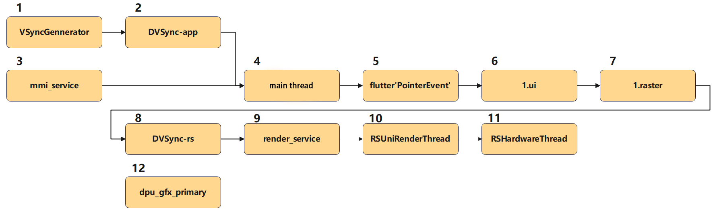
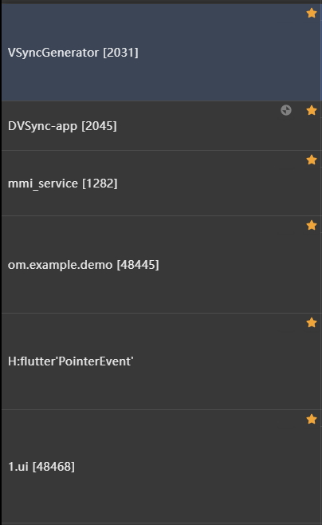
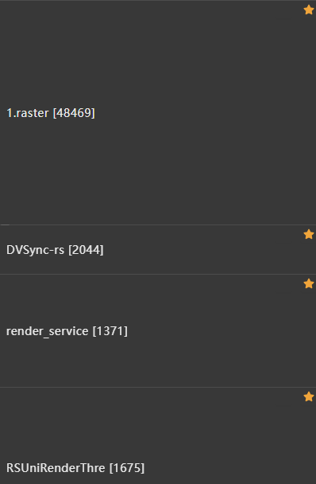
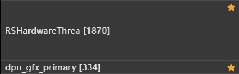

# Performance Analysis: Sorting the Thread Sequence

When analyzing the performance of a Flutter application, use analysis tools to capture and analyze the application's traces. The rendering process of the Flutter application is closely related to several threads. This topic describes these threads and their sequence in the rendering process.

## Analysis Tools
Common analysis tools include [DevEco Studio Profiler](https://developer.huawei.com/consumer/cn/download/) (recommended) and [Smartperf](https://gitcode.com/openharmony/developtools_smartperf_host). For details about how to use the Profiler, see [In-depth Capture for Problem Locating](https://developer.huawei.com/consumer/en/doc/harmonyos-guides-V5/deep-recording-V5).

## Thread Sequence
- Learning how to use analysis tools can help you capture traces of Flutter applications. The traces contain all threads at the application runtime. Mark and sort the threads in the sequence shown in the figure below to better analyze the Flutter application performance. The thread sequence is shown by the number. 
- Because the latest marked thread is displayed on the top of list, it is recommended that you mark threads in reverse order. 
- Thread sequence: (1) VSyncGennerator (2) DVSync-app (3) mmi_service (4) Application main thread (5) flutter'PointerEvent' (6) 1.ui (7) 1. raster (8) DVSync-rs (9) render_service (10) RSUniRenderThread (11) RSHardwareThread (12) dpu_gfx_primary

After the threads are marked and sorted, the thread list is as follows. 
  

  

  

## Thread List
- VSyncGennerator  
VSync signal generator, providing the capability of sensing VSync frames.

- DVSync-app  
VSync signal provided for the application.

- mmi_service  
Multimodal event triggered when a finger touches the screen.

- Application main thread 
A main thread whose thread ID is the same as the application process ID and thread name is the same as the process name. 
It is the main thread of the platform, where the plugin code runs.

- flutter'PointerEvent'  
Procedure from the time the main thread of the Flutter application sends a touch event to the time the UI thread handles the touch event. This thread may not exist.

- 1.ui  
UI thread named **< number >.ui**. 
It executes Dart code in the Dart VM. This thread includes your own code and code generated by the Flutter framework based on application behavior. When an application creates and displays a scenario, the UI thread first creates a layer tree, which is a lightweight object containing device-agnostic rendering commands, and sends the layer tree to the raster thread to be rendered on the device. Do not block this thread. It is displayed at the bottom row of the performance overlay.

- 1.raster  
Raster thread named **< number >.raster**. 
This thread obtains the layer tree and delivers it to the GPU. You cannot directly access the raster thread or its data, but if the thread slows down, it must be caused by somewhere in the Dart code. The graphics library Skia runs on this thread, which is displayed on the top of the performance layer. Note that the raster thread rasterizes the GPU, but the thread itself runs on the CPU.

- DVSync-rs  
VSync signal provided for the RS process.

- render_service  
Main thread of the RS process, which is the first step for sending the frames to RS for display.

- RSUniRenderThread  
Thread of the RS process, which is the second step for sending the frames to RS for display.

- RSHardwareThread  
Thread of the RS process, which is the third step for sending the frames to RS for display.

- dpu_gfx_primary  
Hardware DPU signal.
