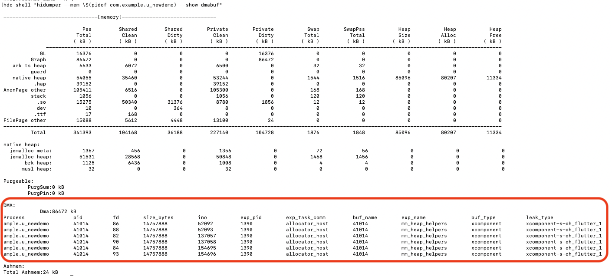
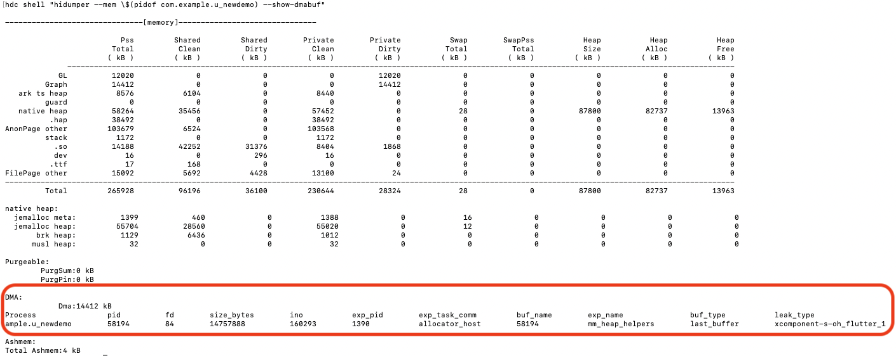

# Performance Tuning - Memory Analysis and Optimization Practices

## 1. Overview

This document is for Flutter developers on HarmonyOS and provides a unified method for memory analysis. It includes:

- [Memory Basics](https://developer.huawei.com/consumer/cn/doc/best-practices/bpta-memory-basic-knowledge) (based on official HarmonyOS definitions).
- Tool usage ([HiDumper](https://developer.huawei.com/consumer/cn/doc/harmonyos-guides/hidumper), [HiProfiler](https://developer.huawei.com/consumer/cn/doc/harmonyos-guides/hiprofiler), and [Flutter DevTools Memory](https://docs.flutter.dev/tools/devtools/memory#memory-view-guide)).
- A practical case for releasing DMA memory when the app goes to background using HiDumper.

## 2. Memory Basics

### 2.1 Total Metrics

HarmonyOS describes the relationships among memory metrics in [Memory Basics](https://developer.huawei.com/consumer/cn/doc/best-practices/bpta-memory-basic-knowledge), including:

- `VSS`: virtual memory size used by the process.
- `RSS`: process memory currently resident in physical memory.
- `PSS`: proportional memory usage after shared-page distribution.
- `USS`: private memory used only by this process.
- `Swap`: memory pages swapped out when physical memory is insufficient.

In troubleshooting, `PSS` more accurately reflects memory usage in multi-process environments.

### 2.2 Component Breakdown

Application memory components include:

- Stack
- mmap allocation region
- Shared Libraries
- Heap
- Heap Alloc / Heap Free
- ArkTS Heap
- Native Heap
- Anonymous Page other
- FilePage Other
- GL (graphics memory)
- BSS/Data/Text/RO Data Segment
- Guard Pages

Flutter apps still run on the same system memory model. Analysis should start from system totals and components, then move to Flutter runtime objects.

## 3. Tools and Observable Memory

### 3.1 [HiDumper](https://developer.huawei.com/consumer/cn/doc/harmonyos-guides/hidumper)

#### How to Use

```bash
# 1) View system memory
hdc shell "hidumper --mem"

# 2) View process memory, where pid is the target app process ID
hdc shell "hidumper --mem <pid> --show-dmabuf"

# 3) View VM heap memory, where pid is the target app process ID
hdc shell "hidumper --mem-jsheap <pid>"
```

#### Mainly Used to Observe

- Process `PSS Total` (overall usage).
- Process components (such as ArkTS Heap, Native Heap, GL, FilePage Other).

HiDumper is the baseline tool for system-level totals and component analysis.

### 3.2 [DevEco Profiler](https://developer.huawei.com/consumer/cn/doc/harmonyos-guides/hiprofiler)

According to HarmonyOS documentation ([Analyze Memory Usage Issues](https://developer.huawei.com/consumer/cn/doc/best-practices/bpta-analyze-memory-problem)), DevEco Profiler can be used for Native memory and kernel-space memory analysis.

#### Native Memory Analysis

Steps:

- Refer to the official steps in [Analyze Native Memory](https://developer.huawei.com/consumer/cn/doc/best-practices/bpta-analyze-memory-problem).

Information available:

- Heap allocation/free records.
- Memory mapping information.
- Call stacks (statistics mode and non-statistics mode).

Native memory in this context mainly includes:

- Heap memory allocated by `malloc/new/realloc/calloc`.
- Address space mapped by `mmap`.

#### Kernel-space Memory Analysis

Steps:

- Refer to the official steps in [Analyze Kernel-space Memory](https://developer.huawei.com/consumer/cn/doc/best-practices/bpta-kernel-memory-analysis).

Memory types listed in the official document:

- `FilePage Other`: ashmem used by the app.
- `GL`: GPU memory used by the app.
- `Graph`: ION memory used by the app.

### 3.3 [Flutter DevTools Memory](https://docs.flutter.dev/tools/devtools/memory#memory-view-guide)

#### How to Use

- Reference guide: [Memory view guide](https://docs.flutter.dev/tools/devtools/memory#memory-view-guide).
- Open the Memory view in Flutter DevTools.
- Observe memory changes through the timeline.
- Use snapshots, diffs, and allocation tracing to locate object growth.

#### Main Metrics in Memory View

- `RSS`
- `Allocated`
- `Dart/Flutter` (Heap)
- `Dart/Flutter Native`
- `GC`
- `Raster Cache`

#### Scope

Flutter DevTools is mainly used for Dart/Flutter runtime memory analysis (objects, heap, and external memory).
For process totals and system-level components, use HiDumper / DevEco Profiler as primary references.

## 4. Practice: Verify DMA Release on Background with [HiDumper](https://developer.huawei.com/consumer/cn/doc/harmonyos-guides/hidumper)

Using a default app created by Flutter as an example:

```bash
flutter create _newdemo
```

Use HiDumper to inspect overall process memory:

```bash
hdc shell "hidumper --mem \$(pidof com.example.u_newdemo) --show-dmabuf"
```

From observation, DMA holds 6 buffers in both foreground and background states, and occupies significant memory in background. Releasing DMA when entering background is therefore considered.

The following image shows background memory before optimization:



After DMA reclamation, only 1 buffer is retained, saving memory equivalent to 5 buffers in background.

The following image shows background memory after optimization:


