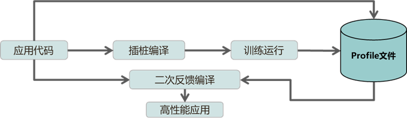
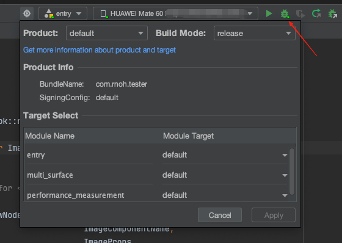
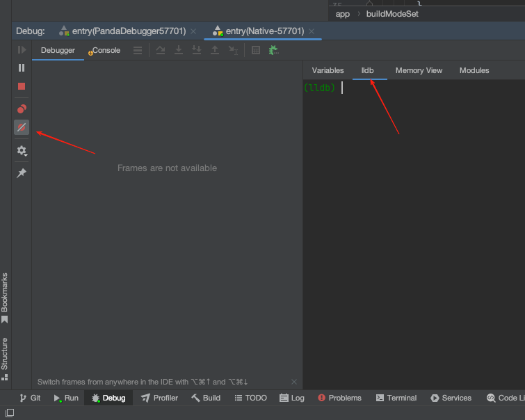
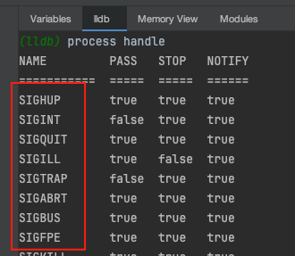
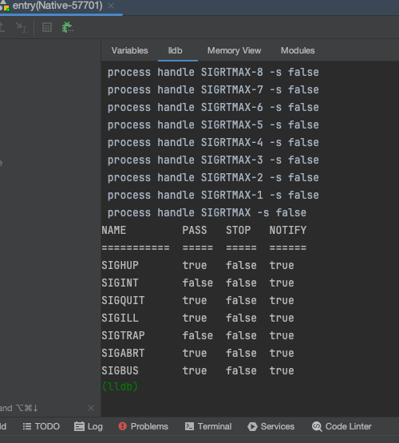

# 性能调优-毕昇编译器开PGO
## 毕昇编译器介绍
毕昇编译器是基于LLVM开源软件开发的一款编译器，在无需改动用户代码的条件下能提供比业界主流的开源LLVM或GCC编译器更强大的优化能力，使编译链接出来的程序运行时长更短、指令数更少，帮助提升应用在设备上的运行流畅度。

您可以在[毕昇文档](https://developer.huawei.com/consumer/cn/doc/harmonyos-guides/bisheng-compiler-V5)中查看更多介绍。

## PGO介绍
PGO（Profile-Guided Optimization）编译优化先在程序运行时采集统计数据，在后续构建过程中基于收集到的数据针对性地优化程序性能。其基本流程如下图

  

您可以在[PGO文档](https://www.hikunpeng.com/document/detail/zh/kunpengdevps/compiler/opg-bisheng/kunpengbisheng_30_0018.html)中查看更多介绍。

## PGO使用
PGO的开启依赖毕昇编译器，确认flutter的产物是否使用毕昇编译器编译。
PGO使用，需要经过以下步骤
1. 编译插桩产物
2. 使用插桩产物运行项目工程，采集运行信息，生成profile文件
3. 使用profile文件，二次反馈编译产物

### 编译插桩产物
更改[engine/src/build/config/compiler/BUILD.gn](https://gitcode.com/openharmony-tpc/flutter_flutter/blob/oh-3.35.7-dev/engine/src/build/config/compiler/BUILD.gn)文件

```diff
# Default "optimization on" config. On Windows, this favors size over speed.
config("optimize") {
...
  if (is_ohos) {
    if (enable_lto) {
      cflags += [ "-flto" ]
      ldflags += [ "-flto" ]
    }

    # The compiler-specific optimization options for BiSheng compiler.
    if (enable_lto && !unuse_bisheng) {
      # Relies on LTO optimization
      cflags += [ "-fwhole-program-vtables" ]
    }

    # The compiler-specific optimization options for BiSheng compiler.
    if (!unuse_bisheng) {
      cflags += [
        "-mllvm","--enable-partial-inlining",
+       "-fprofile-generate=/data/storage/el2/base/files",
+       "-mllvm", "-pgo-instrument-entry=true"
      ]
      ldflags += [
        "-Wl,-mllvm,-wholeprogramdevirt-check=fallback",
        "-Wl,--Bsymbolic-functions",
        "-Wl,--aarch64-inline-plt",
        "-Wl,-mllvm,--enable-partial-inlining",
        "-Wl,-mllvm,--tail-dup-placement",
+       "-fprofile-generate=/data/storage/el2/base/files",
+       "-mllvm", "-pgo-instrument-entry=true"
      ]
    }
  }
}
```
`/data/storage/el2/base/files` 该路径为沙箱路径，会在其映射的路径下产生对应的xxx.profraw文件，映射路径为：`/data/app/el2/100/base/应用包名/files`


编译完成后，使用编译出的插桩版本的har文件替换flutter_flutter中对应平台和模式下的har文件。

查看产物插桩是否成功，可以使用下面命令。由于添加了插桩代码，此时的har文件体积会有一定膨胀。
```
llvm-objdump -S xx.so # 检查是否有llvm_prf字段
llvm-objdump -d xx.so # 看反汇编是否有ldr add store代码序列
```

### 采集运行信息
修改ohos项目工程根路径下的文件`build-profile.json5`，把"buildModeSet"中release 模式下的"debuggable"置为true。如果应用的正式版本的模式命名是自定义的，采集运行信息时，需要把该模式下的"debuggable"置为true，采集运行信息之后，改回false。

```diff
{
    "app": {
        ...
        "buildModeSet": [
            {
                "name": "profile",
                "buildOption": {
                "debuggable": false
                }
            },
            {
                "name": "release",
                "buildOption": {
-                "debuggable": false
+                "debuggable": true
                }
            }
        ]
    }
}
```

添加完成后，尽可能贴近正式发布应用时的配置进行打包，如选择 release 模式等。
如下图所示点击 Debug 按钮构建并启动应用。  
  

点击下方 debug 面板中的 lldb，进入 lldb 工具命令行，点击左侧按钮禁用断点。  
  


在 lldb 命令行中输入 `process handle`，获取所有可能导致程序暂停的信号量名称。  
  

对于每个信号量执行 `process handle [信号量名称] -s false` ，让应用不在收到任何信号量时暂停影响采集。命令执行完后会立即输出信号量信息，可以看到 stop 一列都变成了 false

> Note: 您可以使用文本编辑器提供的[多光标能力](https://code.visualstudio.com/docs/editing/codebasics#_multiple-selections-multicursor)进行高效批量编辑

  

此时在lldb命令行输入采集profile命令 `process signal SIGUSR2` ，即可收集应用启动或上次执行这一命令到现在的应用运行profile。中间不重启应用执行两次采集命令，前一次采集的文件会被后一次覆盖。您可以利用此特性在应用的关键使用场景前后分别执行一次采集命令，这样收集到的就是关键场景使用过程中的profile信息。执行完此命令后检查输出路径对应的沙箱外路径应当看到新生成了名字以 .profraw 结尾的文件。

```shell
hdc shell ls /data/app/el2/100/base/[应用的bundle名]/files/pgoprofraw/
```

将 pgoprofraw 文件夹下载到电脑上
```shell
hdc file recv /data/app/el2/100/base/[应用的bundle名]/files/pgoprofraw/ .
```

使用 llvm-profdata 工具合并多个 profraw 文件并转换格式。llvm-profdata 工具跟步骤一构建日志中 `CXX compiler path:` 后面的 clang++ 在同一个目录下。使用不同版本的构建工具和 llvm-profdata 可能因为数据格式不兼容转换失败。

```shell
/path/to/llvm-profdata merge -output=pgo.profdata ./pgoprofraw/*.profraw
```
上述命令会在当前目录下生成 `pgo.profdata` 文件

### 二次反馈编译

使用采集到的profile信息指导编译器构建高性能应用。注意在打包前恢复[engine/src/build/config/compiler/BUILD.gn](https://gitcode.com/openharmony-tpc/flutter_flutter/blob/oh-3.35.7-dev/engine/src/build/config/compiler/BUILD.gn)文件中临时添加的配置。参考下面的例子修改您的编译选项。

```diff
# Default "optimization on" config. On Windows, this favors size over speed.
config("optimize") {
...
  if (is_ohos) {
    if (enable_lto) {
      cflags += [ "-flto" ]
      ldflags += [ "-flto" ]
    }

    # The compiler-specific optimization options for BiSheng compiler.
    if (enable_lto && !unuse_bisheng) {
      # Relies on LTO optimization
      cflags += [ "-fwhole-program-vtables" ]
    }

    # The compiler-specific optimization options for BiSheng compiler.
    if (!unuse_bisheng) {
      cflags += [
        "-mllvm","--enable-partial-inlining",
-       "-fprofile-generate=/data/storage/el2/base/files",
-       "-mllvm", "-pgo-instrument-entry=true"
+       "-fprofile-use=${自定义路径}/pgo.profdata"
      ]
      ldflags += [
        "-Wl,-mllvm,-wholeprogramdevirt-check=fallback",
        "-Wl,--Bsymbolic-functions",
        "-Wl,--aarch64-inline-plt",
        "-Wl,-mllvm,--enable-partial-inlining",
        "-Wl,-mllvm,--tail-dup-placement",
-       "-fprofile-generate=/data/storage/el2/base/files",
-       "-mllvm", "-pgo-instrument-entry=true"
      ]
    }
  }
}
```
编译出的har产物，既为PGO开启优化后的包。

使用该har产物重新编译应用的项目工程即可，注意项目工程根路径下的文件`build-profile.json5`，把"buildModeSet"中对应模式的"debuggable"置为false。