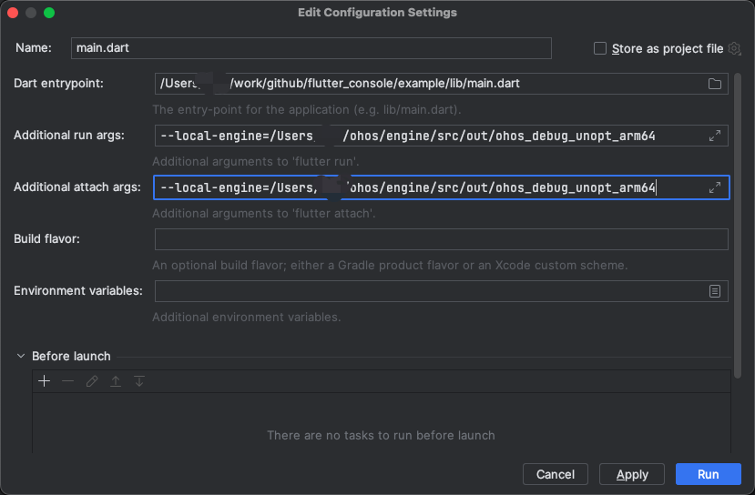

# Debugging Dart Code

- Use DevEco Studio to debug ets code.
- Use VS Code and Android Studio to debug dart code.
  - You need to add the parameters, for example, `--local-engine=/Users/xxx/ohos/engine/src/out/ohos_debug_unopt_arm64`, when debugging the OpenHarmony Fluffer project.

## Using VS Code to Debug Dart Code

Create the **.vscode/launch.json** file in the project directory and enter the parameters as follows:

```
{
    // Use IntelliSense to learn about possible attributes.
    // Hover to view descriptions of existing attributes.
    // For more information, visit: https://go.microsoft.com/fwlink/?linkid=830387
    "version": "0.2.0",
    "configurations": [
        {
            "name": "flutter_sample",
            "request": "launch",
            "type": "dart",
            "args": [
                "--local-engine=/Users/xxx/work/engine_build/engine/src/out/ohos_debug_unopt_arm64"
            ]
        },
        {
            "name": "flutter_sample (profile mode)",
            "request": "launch",
            "type": "dart",
            "flutterMode": "profile",
            "args": [
                "--local-engine=/Users/xxx/work/engine_build/engine/src/out/ohos_profile_arm64"
            ]
        },
        {
            "name": "flutter_sample (release mode)",
            "request": "launch",
            "type": "dart",
            "flutterMode": "release",
            "args": [
                "--local-engine=/Users/xxx/work/engine_build/engine/src/out/ohos_release_arm64"
            ]
        }
    ]
}
```

You can debug the dart code after the modification.

## Using Android Studio to Debug Dart Code



You can debug the dart code after setting the parameters.
