# Developing an ohos Plugin Using Flutter

## 1. Preparations

Set up the Flutter development environment. For details, see https://gitcode.com/openharmony-tpc/flutter_flutter/blob/master/README_EN.md.

Download the third-party plugins from the official plugin library in https://pub.dev/.

This guide uses the adaptation of the **path_provider 2.1.0** plugin as an example. Plugin URL: https://pub-web.flutter-io.cn/packages/path_provider/versions/2.1.0.

## 2. Plugin Directory

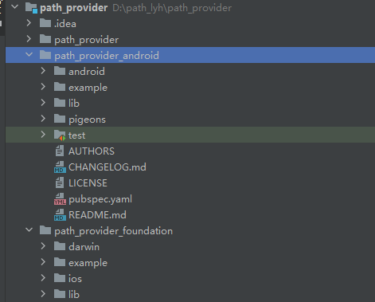

lib: Entry for connecting to the dart code. Through this directory, parameters are received and data is sent to the native platform through the channel.

android: Native Android implementation directory.

ios: Native iOS implementation directory.

example: A Flutter application that describes how to use the plugin.

README_EN.md: Introduction to the package.

CHANGELOG.md: Change records of each version.

LICENSE: A file that contains the license terms of the software package.

## 3. Creating the ohos Module of the Plugin

Required Instruction: `flutter create --platforms ohos,android,ios --org <org> <appName>`

Steps:

(1) Open the downloaded plugin in Android Studio.

(2) Open **Terminal** and execute **cd** to go to the plugin directory.

(3) Execute the `flutter create --platforms ohos path_provider_ohos` instruction to create a Flutter module for the ohos platform.

Before creating the module, the plugin structure is as below.

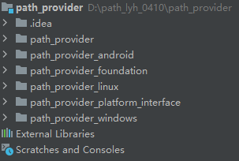

After creating the module, you can delete the **.dart_tool** and **.ldea** files from the **path_provider_ohos** directory.

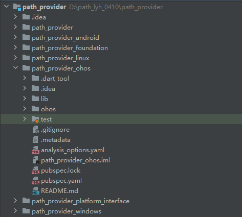


## 4. Compiling the Dart APIs and pubspec.yaml File of the ohos Plugin

You can copy the dart code and **pubspec.yaml** file under **lib** from the **path_provider_android** directory and modify them.

For the dart code, you only need to change **android** to **ohos**.

Dart code in the **lib** directory

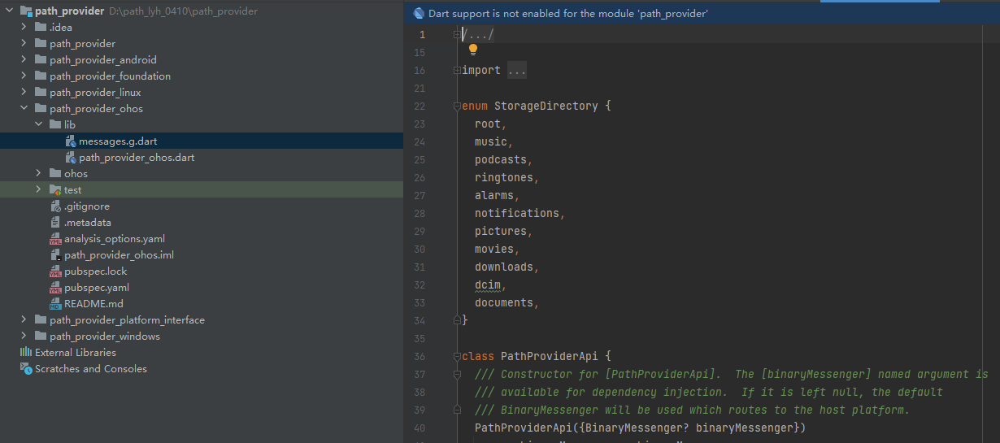

pubspec.yaml file

```
# Example file content for reference:
name: path_provider_ohos
description: Ohos implementation of the path_provider plugin.
repository: https://gitcode.com/openharmony-tpc/flutter_packages/tree/master/packages/path_provider/path_provider_ohos
issue_tracker: https://gitcode.com/openharmony-tpc/flutter_packages/issues
version: 2.2.1

environment:
  sdk: ">=2.18.0 <4.0.0"
  flutter: ">=3.3.0"

flutter:
  plugin:
    implements: path_provider
    platforms:
      ohos:
        package: io.flutter.plugins.pathprovider
        pluginClass: PathProviderPlugin
        dartPluginClass: PathProviderOhos

dependencies:
  flutter:
    sdk: flutter
  path_provider_platform_interface: ^2.0.1

dev_dependencies:
  flutter_test:
    sdk: flutter
  integration_test:
    sdk: flutter
  pigeon: ^9.2.4
  test: ^1.16.0
```

## 5. Building the Native ETS Module of the ohos Plugin

### 1. Create the ohos plugin module.

To build a Flutter plugin instead of an application for the ohos platform, delete the original **entry** module and create a static module of the **path_provider** plugin for compiling the ETS native code.

Steps:

(1) Use DevEco Studio to open the ohos project in the **path_provider_ohos** directory.

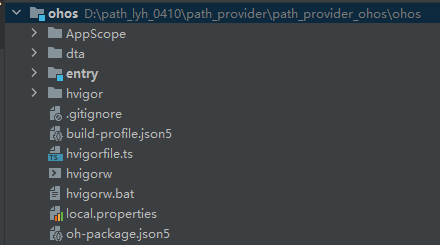

(2) Create a static module named **path_provider**.

Click `File > New > Module > Static Library > Next` in the upper left corner of DevEco Studio.

Set **module name** to `path_provider`, retain the default values for other parameters, and click **Finish**.


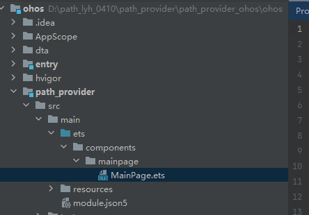

(3) Delete **entry** and other unnecessary directories.

**entry** directory (used to build an application and is not needed here);

All files (which are the template code) in the `path_provider > src > main > ets` directory.

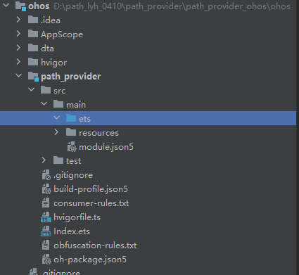


### 2. Modify related configuration files.

(1) Add the **libs/flutter.har** dependency to the **oh-package.json5** file in the **path_provider** directory.

```
{
  "name": "path_provider",
  "version": "1.0.0",
  "description": "Please describe the basic information.",
  "main": "Index.ets",
  "author": "",
  "license": "Apache-2.0",
  "dependencies": {
    "@ohos/flutter_ohos": "file:libs/flutter.har" // Added dependency.
  }
}
```

(2) Delete the **flutter.har** dependency from **oh-package.json5** file outside the **path_provider** directory.

```
{
  "name": "path_provider_ohos",
  "version": "1.0.0",
  "description": "Please describe the basic information.",
  "main": "",
  "author": "",
  "license": "",
  "dependencies": {
  },
  "devDependencies": {
    "@ohos/hypium": "1.0.6"
  },
}
```

(3) Add **flutter.har** to the **path_provider** directory.

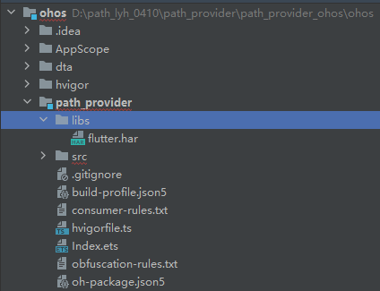


### 3. Write the ets code.

You can refer to the Android or iOS directory to build the file structure and code logic.

For details about the ohos APIs, visit https://gitcode.com/openharmony/docs/tree/master/en.

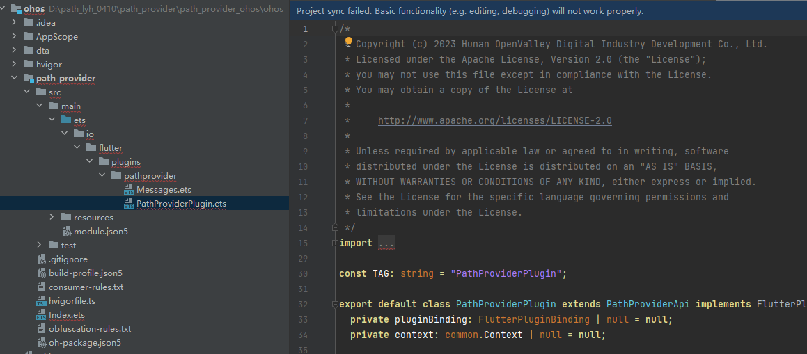


### 4. Modify the index file.

```
# Example file content for reference:
import PathProviderPlugin from './src/main/ets/io/flutter/plugins/pathprovider/PathProviderPlugin'

export default PathProviderPlugin
```

### 5. Pack a HAP file.

You can pack a HAP file after compiling the code and modifying the configuration.

Packing tool: DevEco Studio

Steps: 1. Select the **path_provider** directory. 2. Click **Build** in the menu bar. 3. Click **Make Module'pathprovider'**. 4. Wait until the packing is complete.

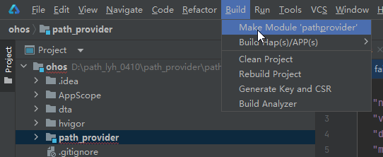

Expected Result:

The **path_proivider.har** file is generated in `path_provider > build > default > outputs `.

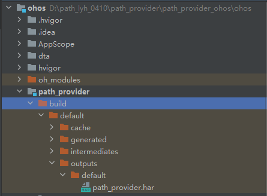


## 6. Writing an Example

### 1. Create a Flutter example application on the ohos platform to verify the features of the plugin.

Execute **cd** to go to the **path_provider_ohos** directory.

Instruction: `flutter create --platforms ohos example`

Tool: Android Studio

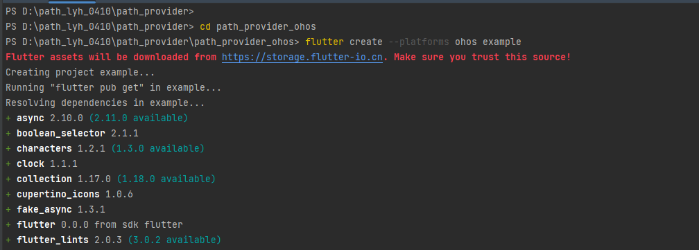

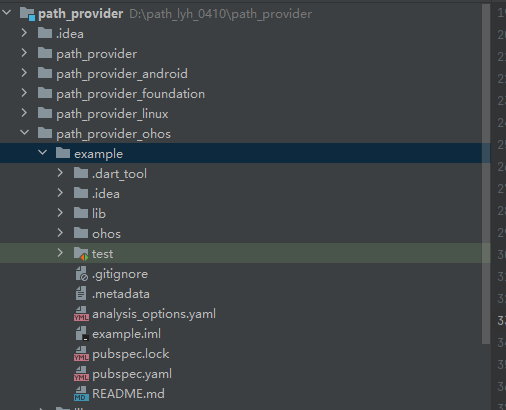

### 2. Modify the dart code.

Copy the **main.dart** code in `path_provider_android\example\lib` to replace the one in `path_provider_ohos\example\lib`.

### 3. Modify the **example pubspec.yaml** file.

```
#Example file content for reference:
name: path_provider_example
description: Demonstrates how to use the path_provider plugin.
publish_to: none

environment:
  sdk: ">=2.18.0 <4.0.0"
  flutter: ">=3.3.0"

dependencies:
  flutter:
    sdk: flutter
  path_provider:
    path: ../../path_provider
  path_provider_platform_interface: ^2.0.0

dev_dependencies:
  flutter_test:
    sdk: flutter
  integration_test:
    sdk: flutter

flutter:
  uses-material-design: true
```

## 7. Modifying the pubspec.yaml File of path_provide

Add ohos in **flutter** > **plugin** > **platforms**.

Add **path_provider_ohos** in **dependencies**.

```
name: path_provider
description: Flutter plugin for getting commonly used locations on host platform file systems, such as the temp and app data directories.
repository: https://github.com/flutter/packages/tree/main/packages/path_provider/path_provider
issue_tracker: https://github.com/flutter/flutter/issues?q=is%3Aissue+is%3Aopen+label%3A%22p%3A+path_provider%22
version: 2.1.0

environment:
  sdk: ">=2.18.0 <4.0.0"
  flutter: ">=3.3.0"

flutter:
  plugin:
    platforms:
      android:
        default_package: path_provider_android
      ios:
        default_package: path_provider_foundation
      linux:
        default_package: path_provider_linux
      macos:
        default_package: path_provider_foundation
      windows:
        default_package: path_provider_windows
      ohos:
        default_package: path_provider_ohos   # Added here.

dependencies:
  flutter:
    sdk: flutter
  path_provider_android: ^2.1.0
  path_provider_foundation: ^2.3.0
  path_provider_linux: ^2.2.0
  path_provider_platform_interface: ^2.1.0
  path_provider_windows: ^2.2.0
  path_provider_ohos:
    path: ../path_provider_ohos    # Added here.

dev_dependencies:
  flutter_test:
    sdk: flutter
  integration_test:
    sdk: flutter
  plugin_platform_interface: ^2.0.0
  test: ^1.16.0
```

## 8. Running the Example

### 1. Sign.

Use Deveco Studio to open the `example > ohos` directory of the third-party library.

Select `Automatically generate signature` in `File > Project Structure > Project > Signing Configs`, wait until the signature is complete, and click `OK`.

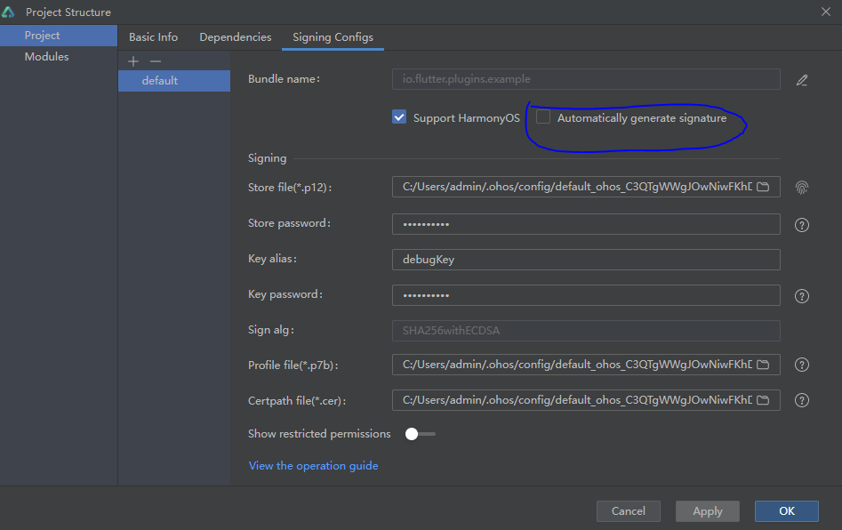

### 2. Run.

Execute **cd** to switch to the `path_provider_ohos\example > ohos` directory and execute the following instructions:

`flutter pub get`

`flutter run -d <device-id>`

**The figure below shows the effect.**

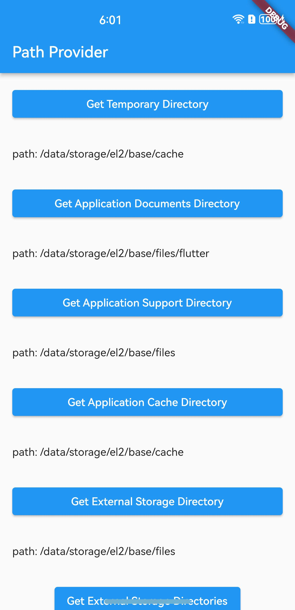

<!--no_check-->