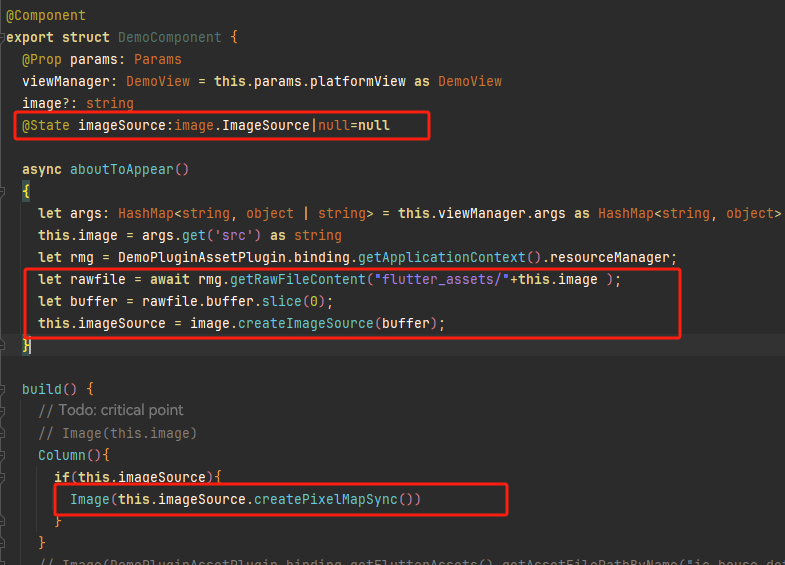

# ohos Code Development

## Determining Whether the Current Platform is ohos in Dart Code

```dart
import 'package:flutter/foundation.dart';

bool isOhos() {
  return defaultTargetPlatform == TargetPlatform.ohos;
}
```


## Execution of flutter run, flutter build har and flutter attach Fail if Platform.isOhos Exists in the Code
Symptom:
**Platform.isOhos** exists in the Flutter code, as shown in the following:
```
if (Platform.isAndroid || Platform.isOhos) {
  print("test");
}
```
When the engine product of the server is depended without specifying the local engine product, the **flutter run**, **flutter build har** and **flutter attach** commands fail to be executed.
Error log:


Solution:
Change **Platform.isOhos** to **defaultTargetPlatform == TargetPlatform.ohos**.


## Native OpenHarmony Applications Fail to Obtain the Image Resources from Flutter
Question:<br>When a plugin is used, the object **binding: FlutterPluginBinding** is returned. A native OpenHarmony application cannot use **binding.getFlutterAssets().getAssetFilePathByName('xxxx')** of this object to obtain the image resources from the Flutter library while it can directly use **Image(this.img)** to obtain on the OpenHarmony platform. Is there any other way to obtain the resource?

Answer:<br>**binding.getFlutterAssets().getAssetFilePathByName('xxxx')** is used to obtain the resource path. To obtain native image resources, see the code as follows:

```
import { image } from '@kit.ImageKit';
@Component
export struct DemoComponent {
  @ObjectLink params: Params
  viewManager: DemoView = this.params.platformView as DemoView
  image?: string
  @State imageSource:image.ImageSource|null=null

  async aboutToAppear() {
    let args: HashMap<string, object | string> = this.viewManager.args as HashMap<string, object>
    this.image = args.get('src') as string
    let rmg = DemoPluginAssetPlugin.binding.getApplicationContext().  resourceManager;
    let rawfile = await rmg.getRawFileContent("flutter_assets/${this.image}");
    let buffer = rawfile.buffer.slice(0);
    this.imageSource = image.createImageSource(buffer);
  }

  build() {
    Column(){
      if(this.imageSource){
        Image(this.imageSource.createPixelMapSync())
      }
    }
  }
  
  // aboutToAppear(): void {
  // let args: HashMap<string, object | string> = this.viewManager.args as   HashMap<string, object>
  // this.image = args.get('src') as string
  // }
  
  // build() {
  // // Todo: critical point
  // // Image(this.image)
  // Image(DemoPluginAssetPlugin.binding.getFlutterAssets().getAssetFilePathByName  (this.image))
  // // Image(DemoPluginAssetPlugin.binding.getFlutterAssets().  getAssetFilePathBySubpath(this.image))
  // }
}
```
Question:

Why the **build** method is directly triggered when I add a breakpoint to **let rawfile = await rmg.getRawFileContent("flutter_assets/"+this.image );** and continue to execute the breakpoint?

Answer:<br>**let rawfile = await rmg.getRawFileContent("flutter_assets/"+this.image );** is a time-consuming operation. During debugging, the remaining code of the current method is not executed until the time-consuming operation returns a result. The **build** method is for rendering only.

## Flutter inappwebview: After setting the height, the webpage content is stretched


Problem analysis: Currently, the native web canvas limit for OS is below 2400, and native web cannot load at heights exceeding 2400
Solution: Convert px type parameters to dp type

```
class _MyHomePageState extends State<MyHomePage> {
  double _height = 10.0;
  
  void _changeHeight(double newHeight) {
    setState(() {
      double devicePixelRatio = MediaQuery.of(context).devicePixelRatio;
      _height = newHeight / devicePixelRatio;
    });
  }
  
  @override
  Widget build(BuildContext context) {
...
```

## Integrate Huawei account one click login in Flutter project

The Flutter project integrates Huawei account one click login. How to use the relevant components of one click login? Please refer to:
[demo](https://gitcode.com/openharmony-tpc/flutter_samples/tree/master/ohos/flutter_huawei_login )

## How to adapt Flutter project to foldable screens

- Mobile phones and foldable screens need to be adapted to vertical screen layouts when folded. Only some special scenarios, such as landscape games and long videos, require adaptation to landscape layout. When the device size ratio approaches 1:1, it is recommended to use the same or similar layout for both horizontal and vertical screens; When there is a large difference in device size ratio, different layouts can be used for horizontal and vertical screens to provide a better user experience.
- For the adaptation of the excavation area, it is necessary to consider that the core content or important interactions should not be obscured by the excavation area. If it is obstructed, local content and other avoidance measures should be taken; Scrollable content does not require special avoidance of excavation areas. To avoid inconsistent left and right blank spaces caused by avoiding digging holes.
- On multi terminal devices, picture in picture functionality is supported in scenarios such as long videos, live broadcasts, meetings, and calls. It is recommended to use extended layout and deformation for responsive adaptation of card advertisements on widescreen devices.
- For the hovering state of foldable screens (where users can stand the product half folded on the desktop), the middle bending area is difficult to operate and the displayed content may deform. Therefore, it is recommended to avoid and adapt the page content to the crease area. Suggest avoiding 16vp (3mm) from the center line upwards for the upper half screen content and 40vp (7mm) from the center line downwards for the lower half screen content. These are an overview of the main solutions for foldable screen design.

Reference:

- [Multi device responsive design](https://developer.huawei.com/consumer/en/doc/design-guides/responsive-design-overview-0000001746498066#section1531711918247)
- [Folding screen UX experience](https://developer.huawei.com/consumer/en/doc/design-guides/ux-guidelines-foldable-screen-0000001807866557)
- [Determine the folding status](https://developer.huawei.com/consumer/en/doc/harmonyos-references-V5/js-apis-display-V5#foldstatus10)
- [Yiduo Development](https://developer.huawei.com/consumer/cn/doc/harmonyos-guides-V5/foreword-V5)
- [Monitor height through windowSizeChange](https://developer.huawei.com/consumer/en/doc/harmonyos-references-V5/js-apis-window-V5#onwindowsizechange7)
- [Folding screen hover](https://developer.huawei.com/consumer/en/doc/design-guides/responsive-design-overview-0000001746498066#section127711650854)
- [FolderStack](https://developer.huawei.com/consumer/en/doc/harmonyos-references-V5/ts-container-folderstack-V5)

## Flutter project startup crashes

Developers are requested to check the top stack log of the crash for the following relevant information. If so, it may be due to a mismatch between the compilation mode of the HAP file and the compiled engine mode, such as compiling the HAP file release package but using the debug mode engine.
Related information:

```
Reason:Signal:SIGABRT(SI_TKILL).............................
........................................................
#01 pc 000000000014710c /system/lib/ld-musl-aarch64.so.1(abort+20).............
........................................................
........................................................
........................................................
```

