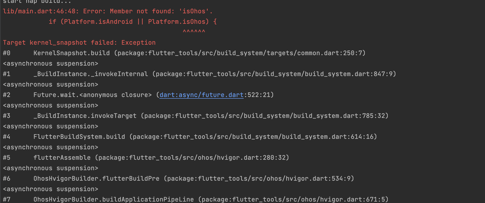
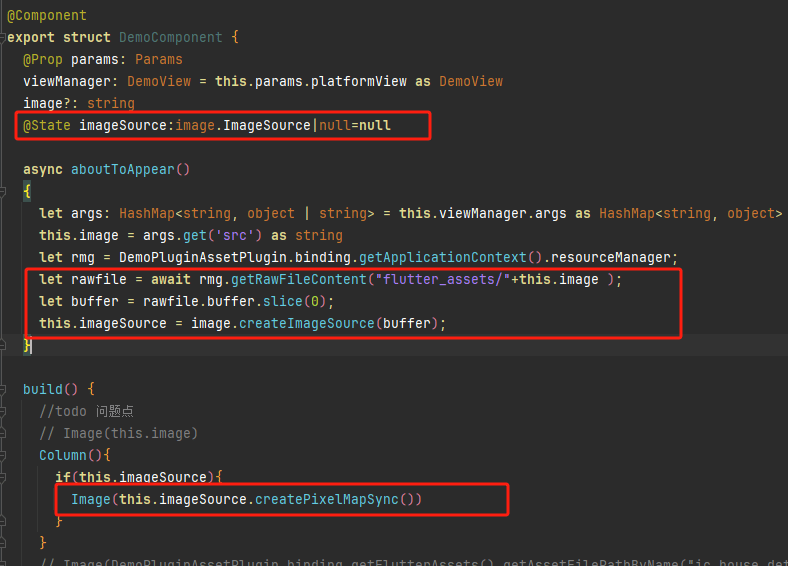

# ohos代码开发相关问题

## dart代码中判断当前平台是否是ohos

```dart
import 'package:flutter/foundation.dart';

bool isOhos() {
  return defaultTargetPlatform == TargetPlatform.ohos;
}
```


## 代码中存在Platform.isOhos会导致fluttn run、flutter build har、flutter attach失败
问题现象：
如果flutter代码中存在Platform.isOhos，如下：
```
if (Platform.isAndroid || Platform.isOhos) {
  print("test");
}
```
会导致flutter run、flutter build har、 flutter attach（不指定本地引擎产物，依赖服务器的引擎产物）失败，
报错信息：


解决方法：
请将 Platform.isOhos 修改成 defaultTargetPlatform == TargetPlatform.ohos


## Flutter OpenHarmony原生端获取到图片资源
问：在使用plugin时， OpenHarmony会返回这个类型的对象binding: FlutterPluginBinding，使用这个对象的binding.getFlutterAssets().getAssetFilePathByName('xxxx') 获取flutter代码库中的图片资源时，OpenHarmony原生端无法获取到图片资源（OpenHarmony端直接用Image(this.img)方法加载）。有什么别的方法能够获取到？

答：binding.getFlutterAssets().getAssetFilePathByName('xxxx')得到的是资源路径，加载原生图片资源可以参考以下实现

```
import { image } from '@kit.ImageKit';
@Component
export struct DemoComponent {
  @ObjectLink params: Params
  viewManager: DemoView = this.params.platformView as DemoView
  image?: string
  @State imageSource:image.ImageSource|null=null

  async aboutToAppear() {
    let args: HashMap<string, object | string> = this.viewManager.args as HashMap<string, object>
    this.image = args.get('src') as string
    let rmg = DemoPluginAssetPlugin.binding.getApplicationContext().  resourceManager;
    let rawfile = await rmg.getRawFileContent("flutter_assets/${this.image}");
    let buffer = rawfile.buffer.slice(0);
    this.imageSource = image.createImageSource(buffer);
  }

  build() {
    Column(){
      if(this.imageSource){
        Image(this.imageSource.createPixelMapSync())
      }
    }
  }
  
  // aboutToAppear(): void {
  // let args: HashMap<string, object | string> = this.viewManager.args as   HashMap<string, object>
  // this.image = args.get('src') as string
  // }
  
  // build() {
  // //todo 问题点
  // // Image(this.image)
  // Image(DemoPluginAssetPlugin.binding.getFlutterAssets().getAssetFilePathByName  (this.image))
  // // Image(DemoPluginAssetPlugin.binding.getFlutterAssets().  getAssetFilePathBySubpath(this.image))
  // }
}
```
问：let rawfile = await rmg.getRawFileContent("flutter_assets/"+this.image ); 这行代码会触发build方法么？ 为什么我打断点打到这一行，然后继续执行断点直接就到build方法了？

答：let rawfile = await rmg.getRawFileContent("flutter_assets/"+this.image );这行代码为耗时操作，debug时会暂不执行当前方法的剩余代码直到耗时操作返回结果，而进入build只是正常渲染流程

## flutter inappwebview设置高度后网页内容被拉伸

问题分析：目前OS原生web画布限制范围是在2400以下，超过2400的高度原生web无法加载

解决方案：将px类型的参数转换为dp类型

```
class _MyHomePageState extends State<MyHomePage> {
  double _height = 10.0;
  
  void _changeHeight(double newHeight) {
    setState(() {
      double devicePixelRatio = MediaQuery.of(context).devicePixelRatio;
      _height = newHeight / devicePixelRatio;
    });
  }
  
  @override
  Widget build(BuildContext context) {
...
```

## Flutter项目里集成华为账号一键登录
Flutter项目里集成华为账号一键登录，如何使用一键登录的相关组件，请参考：
[demo](https://gitcode.com/openharmony-tpc/flutter_samples/tree/master/ohos/flutter_huawei_login )

## Flutter项目如何适配折叠屏
- 手机和折叠屏折叠态，应用需要适配竖屏布局。仅部分特殊场景例如横屏游戏、长视频需要适配横屏布局。当设备尺寸比例接近1:1时，建议横竖屏使用相同或相近的布局；当设备尺寸比例差异大时，横竖屏可以使用不同的布局，从而提供更好的使用体验。
- 对于挖孔区的适配，需要考虑核心内容或重要交互不要被挖孔区遮挡。如果被遮挡，则应进行局部内容等避让；可滚动内容无需专门避让挖孔区。要避免因为避让挖孔导致左右侧留白不一致。
- 在多端设备上，长视频、直播、会议、通话等场景下支持画中画功能。卡片广告在宽屏设备上建议使用延伸布局和形变进行响应式适配。
- 针对折叠屏悬停态（即用户可以将产品半折后立在桌面上），中间弯折区域难以操作且显示内容会变形，因此建议页面内容进行折痕区避让适配。建议上半屏内容由中线向上避让16vp（3毫米）、下半屏内容由中线向下避让40vp（7毫米）。这些是折叠屏设计的主要方案概述。

可参考：

- [多设备响应式设计](https://developer.huawei.com/consumer/cn/doc/design-guides/responsive-design-overview-0000001746498066#section1531711918247)
- [折叠屏UX体验](https://developer.huawei.com/consumer/cn/doc/design-guides/ux-guidelines-foldable-screen-0000001807866557)
- [判断折叠状态](https://developer.huawei.com/consumer/cn/doc/harmonyos-references-V5/js-apis-display-V5#foldstatus10)
- [一多开发](https://developer.huawei.com/consumer/cn/doc/harmonyos-guides-V5/foreword-V5)
- [通过windowSizeChange来监听高度](https://developer.huawei.com/consumer/cn/doc/harmonyos-references-V5/js-apis-window-V5#onwindowsizechange7)
- [折叠屏悬停](https://developer.huawei.com/consumer/cn/doc/design-guides/responsive-design-overview-0000001746498066#section127711650854)
- [FolderStack](https://developer.huawei.com/consumer/cn/doc/harmonyos-references-V5/ts-container-folderstack-V5)

## Flutter项目启动闪退
请开发者在crash的栈顶日志中查看是有如下相关信息，如有，可能是因为编译hap文件模式与编译出来的engine模式不匹配，如：编译hap文件release包，但用的是debug模式的engine引起。
相关信息：

```
Reason:Signal:SIGABRT(SI_TKILL).............................
........................................................
#01 pc 000000000014710c /system/lib/ld-musl-aarch64.so.1(abort+20).............
........................................................
........................................................
........................................................
```

