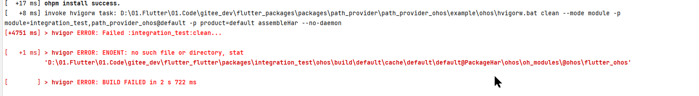

# Updating the Flutter Plugin Structure

## Update Details

- In the **ohos** directory of the Flutter plugin project, the **project** structure is replaced with the **module** structure.
- The HAP files referenced in the Flutter project are stored in the **ohos/har** directory.
- Old module directory from the ohos plugin is deleted.

## How to Update

The following uses **integration_test** in [flutter_flutter](https://gitcode.com/openharmony-sig/flutter_flutter/blob/master/README_EN.md) as an example.

### 1. Changing the integration_test/ohos Directory from Project Structure to Module Structure

> 💡 Note: The following commands are intended to be run in a Unix-like environment (Linux/macOS). If you are using Windows, please use WSL or adapt the commands accordingly.

```sh
cd flutter_flutter/packages/integration_test
mv ohos/ohos ./ohos2
rm -rf ohos
mv ohos2 ohos
cd example
flutter pub get
flutter build hap --debug
```

An error is reported after executing the `flutter run` instruction. You need to modify the **name** field in the configuration file and the **hvigorfile.ts** file.

### 2. Updating Code

#### 2.1 Modify the integration_test/ohos/oh-package.json5 file.

Before the modification:

```json
{
  "name": "ohos",
  "version": "1.0.0",
  "description": "Please describe the basic information.",
  "main": "",
  "author": "",
  "license": "",
  "dependencies": {
  },
  "devDependencies": {
    "@ohos/hypium": "1.0.11"
  }
}
```

After the modification:

```json
{
  "name": "integration_test", // The name should be the same as the plugin name in the pubspec.yaml file.
  "version": "1.0.0",
  "description": "Please describe the basic information.",
  "main": "",
  "author": "",
  "license": "Apache-2.0",
  "dependencies": {
    "@ohos/flutter_ohos": "file:har/flutter.har",
  }
}
```

#### 2.2 Modify the integration_test/ohos/src/main/module.json5 file.

Before the modification:

```json
{
  "module": {
    "name": "ohos",
    "type": "har",
    "deviceTypes": [
      "default",
      "tablet",
      "2in1"
    ]
  }
}
```

After the modification:

```json
{
  "module": {
    "name": "integration_test", // The name should be the same as the plugin name in the pubspec.yaml file.
    "type": "har",
    "deviceTypes": [
      "default",
      "tablet",
      "2in1"
    ]
  }
}
```

#### 2.3 Modify the integration_test/ohos/hvigorfile.ts file.

Before the modification:

```json
import { appTasks } from '@ohos/hvigor-ohos-plugin';

export default {
    system: appTasks,  /* Built-in plugin of Hvigor. It cannot be modified. */
    plugins:[]         /* Custom plugin to extend the functionality of Hvigor. */
}
```

After the modification:

```json
export { harTasks } from '@ohos/hvigor-ohos-plugin';
```

## Checking the Running Status

1. Use DevEco Studio to open **integration_test/example** and configure the signature.
2. Execute the following instructions to run the example:

```
cd integration_test/example
flutter run -d $DEVICE --debug
```

### Paying Attention to the HAP File Reference in the Configuration File When Running the OpenHarmony Application

The referenced HAP file is in the **ohos/har** directory.

#### integration_test/example/ohos/oh-package.json5

After the modification:

```json
{
  // ...
  "dependencies": {
    "@ohos/flutter_ohos": "file:./har/flutter.har"
  },
  "overrides": {
    "@ohos/flutter_ohos": "file:./har/flutter.har"
  }
}
```

#### integration_test/example/ohos/entry/oh-package.json5

Before the modification:

```json
{
  // ...
  "dependencies": {
    "@ohos/integration_test": "file:./har/integration_test.har",
  }
}
```

After the modification:

```json
{
  // ...
  "dependencies": {
    "integration_test": "file:../har/integration_test.har",
  }
}
```

## Possible Errors

### 1. no such file or directory

Error Log:

```log
hvigor ERROR: ENOENT: no such file or directory, stat 'xxx/flutter_flutter/packages/integration_test/ohos/build/default/cache/default/default@packageHar/ohos/oh_modules/@ohos/flutter_ohos'
```



Solution:

Manually delete the file reported in the log message.

### 2. operation not permitted, symlink

Error Log:

```log
hvigor ERROR: ENOENT: operation not permitted, symlink
'xxx/webview_flutter_ohos/ohos/webview_flutter/oh_modules/.ohpm/@ohos+flutter_ohos@file+libs+flutter.har/oh_modules/@ohos/flutter_ohos' -> 
'xxx/webview_flutter_ohos/ohos/build/default/cache/default/default@PackageHar/webview_flutter/oh_modules/@ohos/flutter_ohos'
```

Solution:

After the code is updated, manually delete some directories that exist before the HAP reconstruction. Example:

1. flutter_packages/packages/webview_flutter_ohos/ohos/webview_flutter
2. flutter_packages/packages/path_provider_ohos/ohos/path_provider
3. flutter_packages/packages/file_selector_ohos/ohos/FileSelector
